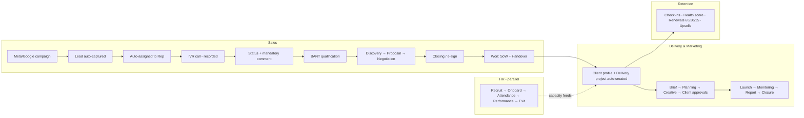

# 01 — Product & Tenancy Overview

**Product:** Zogency — an all-in-one agency CRM, sold white-label.
**Status:** Draft for BRB sign-off.

---

## 1. Vision & strategy

Zogency is a **full-lifecycle CRM for digital marketing agencies**: sales (lead to closed deal), marketing delivery (brief to campaign report), HR (hiring to exit), and client delivery (project execution) in one connected system — built to *enforce* the agency's SOPs rather than sit apart from them.

The strategy has two stages:

1. **Stage 1 — BRB Digital (design partner, tenant #1).** The product is built module-by-module against BRB's real PRD and SOPs (SOP-SLS-01, SOP-MKT-01, SOP-HR-01) with BRB's 8-person team using it daily from the MVP milestone. BRB's feedback shapes the product; BRB becomes the launch case study.
2. **Stage 2 — White-label sales to other agencies.** The same platform is sold to other agencies in **two deployment modes**:
   - **Cloud SaaS** — agencies sign up as tenants on Zogency-operated infrastructure (subscription billing, Phase 3), or
   - **Self-hosted with a license key** — the client buys a **time-limited license key** and runs Zogency on **their own server**. The key carries plan, seats, and expiry; renewal = a new key, no redeploy. See [doc 02 §11](02-technical-architecture.md) for the license design and [doc 02 §12](02-technical-architecture.md) for the recommended server configurations (DigitalOcean).

## 2. What "white-label" means

Per tenant (cloud) or per installation (self-hosted):

| Configurable | Examples |
|---|---|
| Branding | Logo, primary color, email sender name/domain, report/invoice branding (PDFs carry the agency's identity, not Zogency's) |
| Domain | Subdomain (`agency.zogency.com`) or custom domain; self-hosted uses the client's own domain |
| Workflow config | Lead statuses (seeded with the 7 defaults), departments, SLA hours, revision-round limits, discount bands, automation rules, message/proposal templates |
| Integrations | Each tenant/installation connects its **own** Meta, Google, WhatsApp, IVR, e-sign, and accounting accounts |

**Not included (by design):** per-tenant code changes; self-serve signup before Phase 3; payroll processing; full accounting (sync only); native mobile app before Phase 3.

## 3. Personas & roles

BRB has 8 people covering ~14 functional hats, so **users hold multiple roles** (RBAC per [doc 02 §4](02-technical-architecture.md)):

| System role (seeded) | Covers PRD/SOP roles | Primary surfaces |
|---|---|---|
| Admin / Founder | Admin, final approvals, config | Everything + settings, exec dashboard |
| Sales Manager | Pricing approvals, pipeline review, reassignment, coaching | Pipeline, approvals, forecast view |
| Sales Rep | BDE/telecaller: prospecting, IVR calls, discovery, proposals, closing | Lead board, lead detail + call panel, deal room |
| Pre-Sales | Technical scoping, demos, proposal support | Deal room |
| Marketing Manager | Plan/budget/creative approvals, quality, closure | Campaigns, approvals |
| Account Servicing | Client comms, briefs, client sign-offs | Campaigns, client records |
| Strategy / Creative / Digital / Analytics | Campaign strategy, asset production, execution, KPI tracking | Campaign workspaces, task boards |
| HR Manager | Recruitment, onboarding, attendance/leave, reviews, exits | HR module |
| Finance | Pricing validation, invoicing, payments | Invoices, approvals |
| Delivery / Customer Success | Post-sale onboarding, account servicing | Projects, task boards, client health |

## 4. End-to-end flow

The system connects four chains into **one continuous record per client**:

## 5. Module map

| # | Module | One-line scope | Spec | Lands in |
|---|---|---|---|---|
| — | Platform layer | Tenancy, white-label config, RBAC, audit, licensing | 02 | P0–S1 |
| 1 | Lead Capture | Meta/Google/website/CSV ingestion, dedupe, auto-assignment | 04 | P1-S2 |
| 2 | Sales Pipeline + IVR | 7-status workflow, mandatory comments, calls, BANT, proposals, closing | 04 | P1-S3–S5 |
| 3 | Marketing / Campaigns | Brief → plan → creative → approvals → launch → report → closure | 05 | P2 |
| 4 | HR & Team | Recruitment, onboarding, attendance/leave, performance, capacity | 06 | P2 |
| 5 | Client Onboarding & Handover | SoW line items, client auto-create, checklists, kickoff | 04 §7 | P1-S6 |
| 6 | Delivery & Work Mgmt | Projects, department task boards, files, recurring tasks | 07 | P1-S6 basic, P2 full |
| 7 | Retention & Renewal | Check-ins, renewals, health score, churn flags, upsells | 07 | P2 |
| 8 | Invoicing & Payments | GST invoices, payment tracking, reminders, accounting sync | 07 | P1-S6 basic |
| 9 | Reporting & Analytics | Per-module dashboards + executive dashboard | 08 | P1-S6 basic, P2 full |
| — | Automation Engine | Trigger→condition→action rules, seeded + Admin-editable | 08 | P1 engine, P2 UI |

## 6. Source-of-truth documents

Built on BRB's PRD (PRD-CRM-01 v3.0, owners Mr Arvind Mehta / Mr Faizal Ansari) and three SOPs (SOP-SLS-01 Sales, SOP-MKT-01 Marketing, SOP-HR-01 HR). Conflicts between the PRD and the original phase-plan PDF are reconciled in [doc 10 §1](10-sprint-plan.md); unresolved decisions live in [doc 11](11-open-questions-and-risks.md).

## 7. Out of scope (Phase 1)

- Payroll processing (attendance/leave export only — doc 11 Q14)
- Full accounting/bookkeeping (sync with Zoho Books/Tally only)
- Native mobile app (mobile-responsive web; app in Phase 3)
- Client-facing portal (sign-offs via e-sign/logged approval — doc 11 Q13)
- Self-serve tenant signup (Phase 3)
