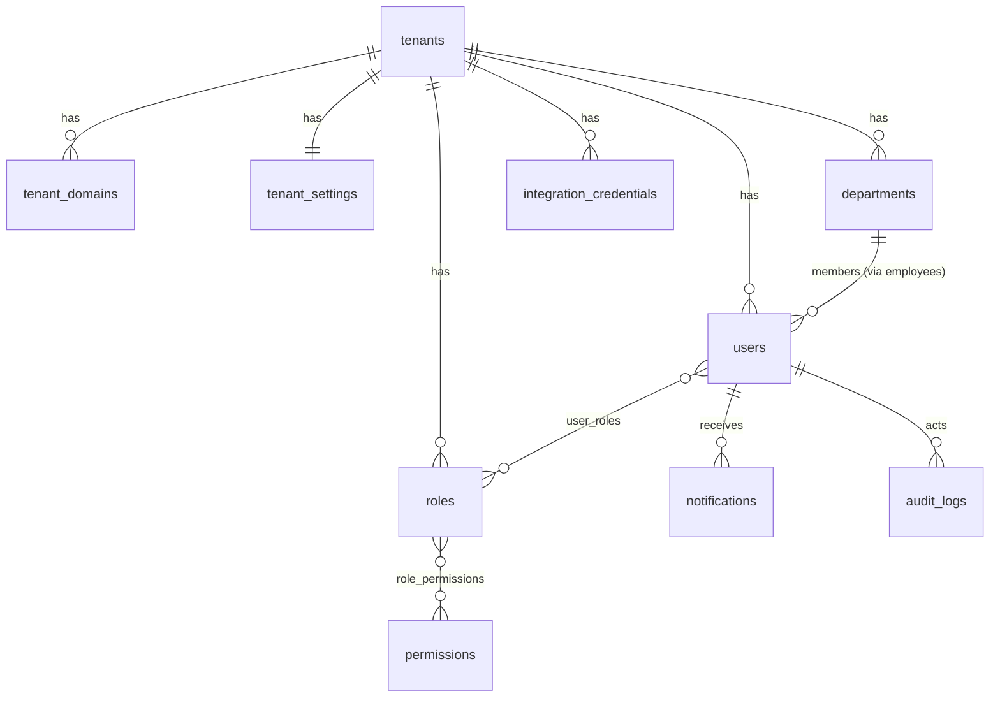
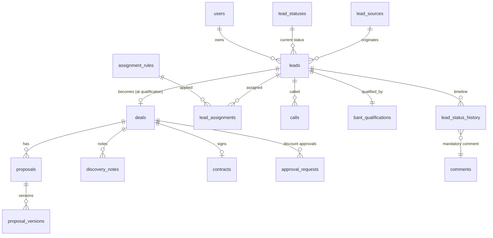
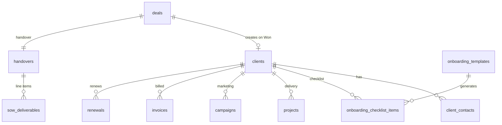
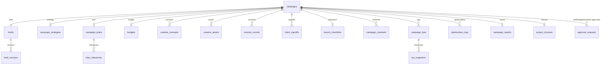
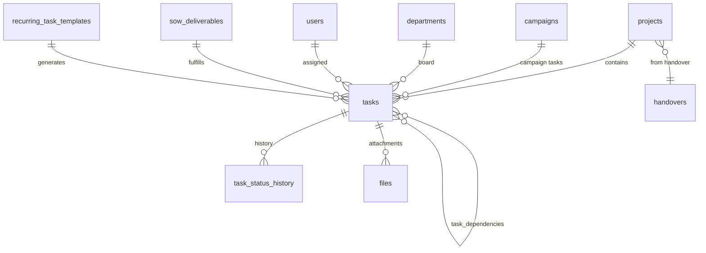
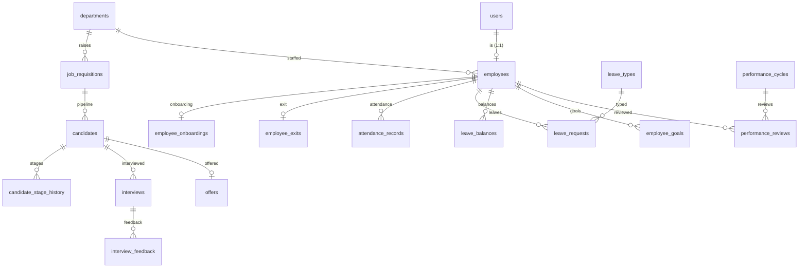
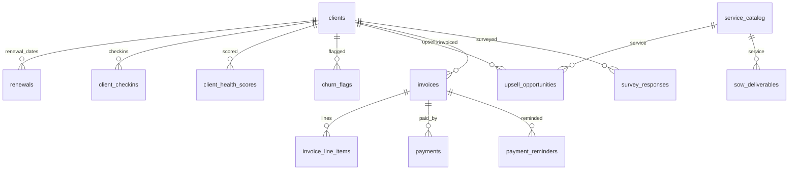
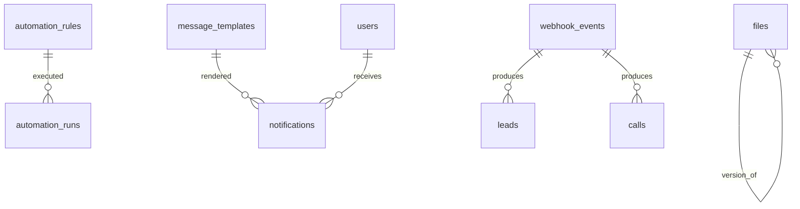

# 03 — Data Model & ERD

**Status:** Draft — this document is the schema contract; the first Prisma migration is generated from it.
**Related docs:** [02-technical-architecture.md](02-technical-architecture.md) (tenancy enforcement), functional specs 04–08 (behavior per entity), [11-open-questions-and-risks.md](11-open-questions-and-risks.md) (unresolved modeling questions).

---

## 1. Modeling conventions

Unless stated otherwise, **every table** has:

| Field | Type | Notes |
|---|---|---|
| `id` | uuid (v7) | Primary key; v7 for index locality |
| `tenant_id` | uuid FK → `tenants` | On all tenant-scoped tables (everything except the *global* tables listed in §2.1); in every index and unique constraint |
| `created_at` | timestamptz | Default now() |
| `created_by` | uuid FK → `users`, nullable | Null for system/webhook-created rows |
| `updated_at` | timestamptz | Mutable tables only |

- **Soft delete:** `archived_at` on user-facing records (leads, clients, campaigns, projects, employees…). Hard DELETE is reserved for platform admin + compliance erasure. Append-only tables are never deleted.
- **Naming:** snake_case tables, plural; enum values snake_case.
- **Money:** `numeric(12,2)` + `currency` char(3) (tenant default INR).

## 2. Tenant isolation

### 2.1 Global (non-tenant) tables
`tenants`, `tenant_domains`, `permissions`, `platform_admins`, `plans` (Phase 3). Everything else carries `tenant_id` and is covered by the ORM tenant guard (doc 02 §3.2) — a CI test asserts every model is registered as scoped or global.

### 2.2 Scoped uniqueness examples
- `leads`: `@@unique([tenant_id, phone])`, `@@unique([tenant_id, email])` (nullable-aware partial indexes — used for FR-1.4 dedupe)
- `users`: `@@unique([tenant_id, email])`
- `webhook_events`: `@@unique([tenant_id, source, external_id])`
- `attendance_records`: `@@unique([tenant_id, employee_id, date])`

## 3. Immutability & audit pattern

Two immutability classes, per the Data Integrity NFR ("status/comment history is immutable — edits create new entries, never overwrites"):

- **[A] Append-only:** rows are never UPDATEd or DELETEd. Corrections insert a new row with `supersedes_id` → the corrected row; readers show the latest non-superseded row, with history expandable. Enforced in the domain layer and by a DB trigger backstop that raises on UPDATE/DELETE.
  - Tables: `lead_status_history`, `lead_assignments`, `comments`, `audit_logs`, `webhook_events`, `discovery_notes`, `sla_escalations`, `revision_rounds`, `client_signoffs`, `optimization_logs`, `kpi_snapshots`, `task_status_history`, `candidate_stage_history`, `interview_feedback`, `attendance_records`, `performance_reviews`, `client_checkins`, `client_health_scores`, `churn_flags`, `payments`, `payment_reminders`, `accounting_sync_log`, `automation_runs`, `notifications`, `report_snapshots`, `creative_concepts`.
  - (`calls` is append-mostly: the row is created at dial time and finalized once with duration/outcome/recording; thereafter immutable.)
- **[V] Versioned:** a mutable parent row + immutable version rows: `proposals`/`proposal_versions`, `briefs`/`brief_versions`, `files` (via `version_of` chain).
- Everything else is mutable, with every mutation captured in `audit_logs` (before/after diff) in-transaction.

## 4. Domain ERDs

### 4.1 Platform & tenancy

### 4.2 Sales — leads, pipeline, calls, deals

### 4.3 Clients, handover, onboarding

### 4.4 Marketing — campaigns

### 4.5 Delivery — projects & tasks

### 4.6 HR

### 4.7 Retention & finance

### 4.8 Automation, files, notifications

## 5. Entity dictionary

Format: **entity** [immutability] — purpose · key fields · relationships · FRs served · phase introduced (per doc 10 sprint plan).

### 5.1 Platform & tenancy

| Entity | Detail |
|---|---|
| **tenants** *(global)* | The agency account. `name, slug, status(active/suspended), locale, timezone, currency, plan` · root of all data · Multi-tenancy · P0 |
| **tenant_domains** *(global)* | Subdomain/custom-domain → tenant resolution. `domain, is_primary, verified_at` · N:1 tenants · White-label · P0 |
| **tenant_settings** | 1:1 per tenant. Branding (`logo_file_id, primary_color, email_sender_name/address`), SLA hours (default 24h per FR-2.5), default revision-round limit, feature flags JSON · Configurability NFR · P0 |
| **tenant_subscriptions** | Plan, billing status, seat/usage limits · Phase-3 SaaS layer · P3 |
| **users** | Login identity. `email, phone, password_hash, totp_secret, status, last_login_at` · N:M roles; 1:0..1 employees · All modules · P0 |
| **roles** | Tenant-scoped, seeded from system defaults. `name, is_system` · N:M permissions · RBAC NFR · P0 |
| **permissions** *(global)* | Code-defined catalog. `key, module, description` · — · RBAC · P0 |
| **user_roles / role_permissions** | Join tables; users hold **multiple** roles · RBAC · P0 |
| **departments** | Task-board owner + org unit. `name, type, head_user_id, sort` — tenant-configurable list (PRD open question on final departments) · 1:N employees, tasks · FR-6.2, FR-4.11 · P1 |
| **audit_logs** [A] | `actor_id, action, entity_type, entity_id, before jsonb, after jsonb, ip, at` · polymorphic · Security NFR · P0 |
| **notifications** [A] | Outbound + in-app. `user_id, channel(in_app/email/whatsapp/sms), template_key, payload jsonb, status, read_at, delivered_at, error` · N:1 users · FR-1.6, FR-3.15, FR-10.x · P1 |
| **files** | `storage_key, filename, mime, size, entity_type, entity_id, version_of, uploaded_by` · polymorphic attach; version chains · FR-3.9, FR-6.4, recordings · P1 |
| **comments** [A] | `body, entity_type, entity_id, author_id, supersedes_id` · polymorphic (leads, tasks, campaigns, candidates…) · FR-2.7–2.9 · P1 |
| **webhook_events** [A] | `source(meta/google/ivr/esign/whatsapp), external_id, raw jsonb, status(received/processed/failed), processed_at, error` · precedes leads/calls · FR-1.1/1.2 reliability, dedupe, replay · P1 |
| **integration_credentials** | `provider, config_encrypted, status, connected_by, connected_at` · N:1 tenants · §17 integrations · P1 |

### 5.2 Sales

| Entity | Detail |
|---|---|
| **lead_sources** | `type(meta/google/website/referral/cold_call/linkedin/event/csv), name, campaign_ref, is_mql` · 1:N leads · FR-1.1–1.3, FR-1.7 (MQL vs SQL tagging) · P1 |
| **lead_statuses** | **Tenant-scoped seeded table, not a DB enum** (Admin-editable per FR-2.6 + Configurability NFR). Seed: New, Connected, Follow-up, Meeting Scheduled, Meeting Done, Junk, Won. `name, sort, is_terminal, is_won, is_junk, color` · 1:N leads · FR-2.6 · P1 |
| **leads** | `name, company, phone, email, city, industry, source_id, status_id, owner_id, sla_due_at, first_contacted_at, junk_reason, archived_at` — `city`/`industry` required for FR-9.1 reporting · 1:N history/calls/comments; 0..1 deals · FR-1.4/1.5, FR-2.x, FR-9.1 · P1 |
| **lead_status_history** [A] | `lead_id, from_status_id, to_status_id, comment_id (NOT NULL — mandatory comment), actor_id, at` · N:1 leads · FR-2.7–2.9, Data Integrity NFR · P1 |
| **lead_assignments** [A] | `lead_id, assignee_id, assigned_by(null=system), rule_id, at` — latest row = current owner; measures the <1-min NFR · N:1 leads · FR-1.5 · P1 |
| **assignment_rules** | `strategy(round_robin/territory/product_line/account_size), criteria jsonb, target_user_ids, priority, enabled` · applied by worker · FR-1.5 · P1 |
| **calls** | `lead_id, user_id, provider, provider_call_id, direction, started_at, duration_sec, disposition, outcome_note, recording_file_id, is_manual_log` · N:1 leads; 1:0..1 files · FR-2.1–2.4, Call Quality NFR · P1 |
| **bant_qualifications** | 1:1 lead. `budget_range, authority(role/contact), need, timeline, qualified_by, qualified_at` — gate before Follow-up (see doc 04 §3.4 / doc 11 Q7) · FR-2.10 · P1 |
| **deals** | Created at qualification (ADR-004). `lead_id, value, stage(open/verbal_commit/won/lost), lost_reason, expected_close_on, won_at, final_terms jsonb, owner_id` · 1:1→leads; 1:N proposals; 1:0..1 clients · FR-2.16–2.18, FR-9.1 forecast · P1 |
| **discovery_notes** [A] | `deal_id, business_challenges, requirements, budget_notes, decision_timeline, author_id` · N:1 deals · FR-2.11 · P1 |
| **proposal_templates** | `service_line, name, body_file_id/template_ref, active` · 1:N proposals · FR-2.12, Configurability NFR · P1 |
| **proposals / proposal_versions** [V] | Parent: `deal_id, current_version, status(draft/sent/revised/accepted)`. Version [A]: `version_no, amount, document_file_id, sent_at, sent_by, change_note` · FR-2.14/2.15 (versioned negotiation trail) · P1 |
| **approval_requests** | **Generic approval workflow**, reused across modules. `type(discount/budget/brief/creative_internal/requisition/compensation), entity_type, entity_id, requested_by, approver_id, state(pending/approved/rejected), decision_note, requested_at, decided_at` — state transitions append to audit_logs · FR-2.13, FR-3.3/3.6/3.8, FR-4.1 · P1 |
| **contracts** | `deal_id, provider(zoho_sign/docusign/logged), envelope_id, status(draft/sent/signed/declined), signed_at, document_file_id` · 1:1 deals · FR-2.17 · P1 |
| **sla_escalations** [A] | `entity_type, entity_id, rule_ref, breached_at, escalated_to, resolved_at` · — · FR-2.5, FR-10.4 · P1 |

### 5.3 Clients, handover, onboarding

| Entity | Detail |
|---|---|
| **clients** | Auto-created on Won (FR-5.1) merging lead history. `name, legal_name, gstin, origin_lead_id, origin_deal_id, owner_id, status(active/paused/churned), archived_at` · hub for projects/campaigns/invoices/renewals · FR-5.1 · P1 |
| **client_contacts** | `client_id, name, role, phone, email, is_primary` · N:1 clients · FR-2.20 · P1 |
| **handovers** | `deal_id, client_id, account_context, commitments, key_contacts_note, completed_at, kickoff_scheduled_at, kickoff_event_ref` · 1:1 deals · FR-2.20/2.21, FR-5.5 · P1 |
| **sow_deliverables** | **Individual line items, mandatory before Won** (PRD risk mitigation). `handover_id, service_id, description, quantity, frequency(one_time/monthly/weekly…), deadline, status` · 1:N handover; feeds delivery tasks + FR-6.6 view · FR-5.2/5.3 · P1 |
| **onboarding_templates / onboarding_checklist_items** | Template keyed by service; items generated per client on handover. Item: `client_id, template_item_ref, title, assignee_id, due_on, done_at` · FR-5.4 · P1 |

### 5.4 Marketing

| Entity | Detail |
|---|---|
| **campaigns** | Marketing project hub. `client_id (nullable = internal), name, status(brief/planning/creative/approval/launched/monitoring/reporting/closed), manager_id, account_owner_id` · 1:1 briefs etc. · Module 3 · P2 |
| **briefs / brief_versions** [V] | `campaign_id`; version: `objectives, target_audience, deliverables, timeline, budget_estimate` — internal sign-off via approval_requests · FR-3.1–3.3 · P2 |
| **campaign_strategies** | `approach, audience_segments jsonb, key_messages, channel_mix jsonb` · 1:1 campaigns · FR-3.4 · P2 |
| **campaign_plans / plan_milestones** | Plan: timeline bounds, resource allocation jsonb. Milestone: `title, due_on, owner_id, status` · FR-3.5 · P2 |
| **budgets** | `campaign_id, amount, breakdown jsonb, approval_request_id` · 1:1 campaigns · FR-3.6 · P2 |
| **creative_concepts** [A] | `campaign_id, title, concept, direction, file_ids` · N:1 campaigns · FR-3.7/3.8 · P2 |
| **creative_assets** | `campaign_id, task_id, type(copy/design/video/digital), title, current_file_id (version chain via files.version_of), status(draft/internal_review/client_review/approved)` · FR-3.9 · P2 |
| **revision_rounds** [A] | `campaign_id, asset_id, round_no, feedback, source(client/internal), logged_by` — counted vs limit (`campaigns.revision_limit`, default from tenant_settings, overridable per client contract) · FR-3.10/3.11 · P2 |
| **client_signoffs** [A] | `campaign_id, scope(asset/final/launch), method(esign/logged_written), evidence_file_id, signed_by_contact_id, at` · FR-3.12 · P2 |
| **launch_checklists (+items)** | `campaign_id`; items: `title(tracking/scheduling/channel_readiness/custom), checked_by, checked_at` · FR-3.13 · P2 |
| **campaign_channels** | `campaign_id, channel(meta/google/social/email/other), go_live_at, status(scheduled/live/paused/ended)` · FR-3.14/3.15 · P2 |
| **campaign_kpis / kpi_snapshots** [A] | KPI: `name(reach/ctr/conversions/custom), target`. Snapshot: `kpi_id, value, captured_at, source(manual/api)` · FR-3.16, FR-9.2 · P2 |
| **optimization_logs** [A] | `campaign_id, change_type(targeting/budget/creative), description, reasoning, actor_id` · FR-3.17 · P2 |
| **campaign_reports** | `campaign_id, compiled jsonb, report_file_id, presented_at, presented_by` · FR-3.18/3.19 · P2 |
| **project_closures** | `campaign_id, learnings, archive_ref, closed_by, closed_at` · FR-3.20 · P2 |

### 5.5 Delivery

| Entity | Detail |
|---|---|
| **projects** | Auto-created on Won (FR-6.1, FR-10.3). `client_id, handover_id, name, type(retainer/one_off), status(active/paused/completed), start_on, end_on` · 1:N tasks · FR-6.1 · P1 (basic) |
| **tasks** | `project_id / campaign_id (one required), department_id, assignee_id, sow_deliverable_id, title, description, deadline, priority(low/med/high/urgent), status(todo/in_progress/review/done/blocked), recurring_template_id` · dependencies via join · FR-6.2/6.3/6.6, FR-4.11 (capacity source) · P1 (basic) |
| **task_dependencies** | `task_id, depends_on_task_id` · FR-6.3 · P2 |
| **task_status_history** [A] | `task_id, from, to, actor_id, at` · FR-9.3 turnaround metrics · P1 |
| **recurring_task_templates** | `project_id, title_template, department_id, cadence (cron expr), next_run_on, active` — worker generates task instances · FR-6.5 · P2 |

### 5.6 HR

| Entity | Detail |
|---|---|
| **employees** | 1:1 users. `user_id, department_id, manager_id, designation, employment_type(permanent/contract/intern), joined_on, probation_ends_on, status(active/notice/exited), exited_on` · Module 4 spine · P2 |
| **job_requisitions** | `department_id, role_title, headcount, budget_range, justification, raised_by, approval_request_id, status(open/on_hold/filled/cancelled)` · SOP-HR MRF · FR-4.1 · P2 |
| **candidates** | `requisition_id, name, phone, email, resume_file_id, current_stage(applied/screening/interview/offer/hired/rejected), rejection_reason, notice_period, expected_ctc` · FR-4.2 · P2 |
| **candidate_stage_history** [A] | `candidate_id, from, to, actor_id, at` · FR-4.2 · P2 |
| **interviews / interview_feedback** [A] | Interview: `candidate_id, round(technical/hr/assessment), scheduled_at, calendar_event_ref, panel_user_ids`. Feedback: `interview_id, interviewer_id, competency_scores jsonb, recommendation(hire/no_hire), notes` · FR-4.3, SOP-HR steps 8–12 · P2 |
| **offers** | `candidate_id, letter_file_id, compensation_encrypted, status(draft/sent/accepted/declined), joining_on, approval_request_id` · FR-4.4 · P2 |
| **employee_onboardings (+items)** | Checklist per hire: documentation, asset/access provisioning, induction schedule; Day-1 auto-link to department board + manager (FR-4.6) · FR-4.5 · P2 |
| **employee_exits** | `employee_id, type(resignation/termination), notice_start_on, last_day_on, exit_interview_notes, asset_recovery jsonb, access_revoked_at` · FR-4.7 · P2 |
| **attendance_records** [A] | `employee_id, date, in_at, out_at, mode(office/wfh/leave/holiday), source(manual/self)` · unique (tenant, employee, date) · FR-4.8; payroll export · P2 |
| **leave_types / leave_balances / leave_requests** | Types: `name, annual_quota, carry_forward`. Balance: `employee_id, type_id, year, available, used`. Request: `employee_id, type_id, from_on, to_on, reason, approval state (via reporting manager), status` · FR-4.9/4.10 · P2 |
| **holidays** | `date, name` · attendance calc · P2 |
| **performance_cycles / employee_goals / performance_reviews** [A] | Cycle: `name, period_start/end, status`. Goal: `employee_id, cycle_id, title, kpi, target, weight`. Review: `employee_id, cycle_id, self_assessment, manager_review, final_rating, reviewed_by` · FR-4.12/4.13 · P2 |

### 5.7 Retention & finance

| Entity | Detail |
|---|---|
| **renewals** | `client_id, contract_ref, renewal_on, value, status(upcoming/in_progress/renewed/lost)` — worker fires 60/30/15-day outreach triggers · FR-7.2 · P2 |
| **client_checkins** [A] | `client_id, scheduled_at, held_at, notes, owner_id` · FR-7.1 · P2 |
| **client_health_scores** [A] | `client_id, score (0–100), components jsonb (payment_delay, approval_turnaround, survey), computed_at` — formula in doc 07 §3.3, pending sign-off (doc 11 Q9) · FR-7.3 · P2 |
| **churn_flags** [A] | `client_id, reason, severity, escalated_to, resolved_at` · FR-7.4 · P2 |
| **service_catalog** | `name, description, price_band, active` · referenced by SoW + upsells + proposal templates · FR-7.5 · P1 |
| **upsell_opportunities** | `client_id, service_id, stage(idea/proposed/won/lost), value, owner_id` · FR-7.5 · P2 |
| **invoices / invoice_line_items** | Invoice: `client_id, project_id, number (tenant-scoped sequence), issue_on, due_on, subtotal, gst_rate, gst_amount, total, status(pending/partial/paid/overdue), external_accounting_id`. Line: `description, sow_deliverable_id, qty, rate, amount` · FR-8.1/8.2/8.4 · P1 (basic) |
| **payments** [A] | `invoice_id, amount, method, received_on, reference` · FR-8.2; health-score input · P1 |
| **payment_reminders** [A] | `invoice_id, sent_at, channel, template_key` · FR-8.3 · P1 |
| **accounting_sync_log** [A] | `direction(push/pull), entity_type, entity_id, external_id, status, error, at` · FR-8.4 · P2 |
| **surveys / survey_responses** | `client_id, type(nps/csat), score, comment, at` · FR-7.3 input · P2 |

### 5.8 Automation & reporting

| Entity | Detail |
|---|---|
| **automation_rules** | Admin-editable per tenant. `name, trigger_type(record_created/status_changed/date_reached/sla_breach), entity_type, conditions jsonb, actions jsonb, enabled, run_order` · seeded defaults per doc 08 §2 · FR-10.1–10.4 · P1 (engine) / P2 (admin UI) |
| **automation_runs** [A] | `rule_id, trigger_entity_type/id, actions_executed jsonb, status(success/partial/failed), error, at` · debuggability · P1 |
| **message_templates** | `channel(email/whatsapp/sms/in_app), key, name, body, variables jsonb, whatsapp_approval_status` · used by notifications · FR-10.1/10.2 · P1 |
| **report_snapshots** [A] | `dashboard_key, period, scope jsonb, computed jsonb, computed_at` — precompute for the 3s dashboard NFR · FR-9.1–9.6 · P2 |

**Total: ~66 entities.** Module 9 (Reporting) is otherwise derived — no additional tables beyond `kpi_snapshots` and `report_snapshots`.

## 6. Enum catalog

| Enum | Values | Storage |
|---|---|---|
| Lead status | New, Connected, Follow-up, Meeting Scheduled, Meeting Done, Junk, Won | **Tenant-scoped table** (`lead_statuses`), seeded — Admin-editable (FR-2.6) |
| Deal stage | open, verbal_commit, won, lost | DB enum (workflow-critical, code depends on it — ADR-004) |
| Candidate stage | applied, screening, interview, offer, hired, rejected | DB enum (FR-4.2 fixes them) |
| Task status | todo, in_progress, review, done, blocked | DB enum |
| Invoice status | pending, partial, paid, overdue | DB enum (overdue is computed → materialized by nightly job) |
| Approval state | pending, approved, rejected | DB enum |
| Campaign status | brief, planning, creative, approval, launched, monitoring, reporting, closed | DB enum |
| Departments | SEO, Design, Social, Video, Content, Web, Performance (seed) | **Tenant-scoped table** — PRD open question on final list |
| Notification channel | in_app, email, whatsapp, sms | DB enum |
| Priority | low, medium, high, urgent | DB enum |

Rule of thumb: anything the PRD's Configurability NFR says Admin can edit (statuses, departments, templates, rules) is a **tenant-scoped table with seeded defaults**; anything code branches on structurally is a DB enum.

## 7. Indexing & data-volume notes

- **Dedupe:** partial unique indexes `(tenant_id, phone) WHERE phone IS NOT NULL` and `(tenant_id, email) WHERE email IS NOT NULL` on `leads`; `(tenant_id, source, external_id)` on `webhook_events`.
- **Timeline reads:** `(tenant_id, lead_id, at)` on `lead_status_history`, `comments (entity_type, entity_id, created_at)`, `calls (lead_id, started_at)`.
- **Pipeline board:** `(tenant_id, status_id, owner_id)` on leads.
- **SLA sweeps (worker):** `(tenant_id, sla_due_at) WHERE first_contacted_at IS NULL` on leads; `(tenant_id, due_on, status)` on invoices; `(tenant_id, renewal_on, status)` on renewals; `(tenant_id, deadline, status)` on tasks.
- **Growth tables:** `kpi_snapshots`, `audit_logs`, `webhook_events`, `notifications`, `report_snapshots` — expect millions of rows over years; time-partition when needed (not day 1); archive policy: `webhook_events` raw payloads prunable after 12 months, `audit_logs` retained indefinitely.
- **Volume reality check:** an 8-person agency generates small data (thousands of leads/year). Indexes above are for correctness and the multi-tenant future, not day-1 performance pressure.

## 8. Migration & seed plan

1. Migration 1 (Phase 0): platform tables (§5.1) + auth + RBAC seed (system roles, permission catalog).
2. Migration 2 (P1 S2–S3): sales tables + `lead_statuses` seed (7 defaults) + `service_catalog`.
3. Migration 3 (P1 S4–S6): calls, deals, proposals, contracts, clients, handover, projects/tasks (basic), invoices, automation engine tables + seeded rules + message templates.
4. Phase-2 migrations: marketing, HR, retention, reporting snapshot tables.
5. Seed script creates: tenant "BRB Digital", departments, roles→users mapping from BRB's actual team (to be collected — doc 11 Q22), lead statuses, default automation rules, default message templates.
