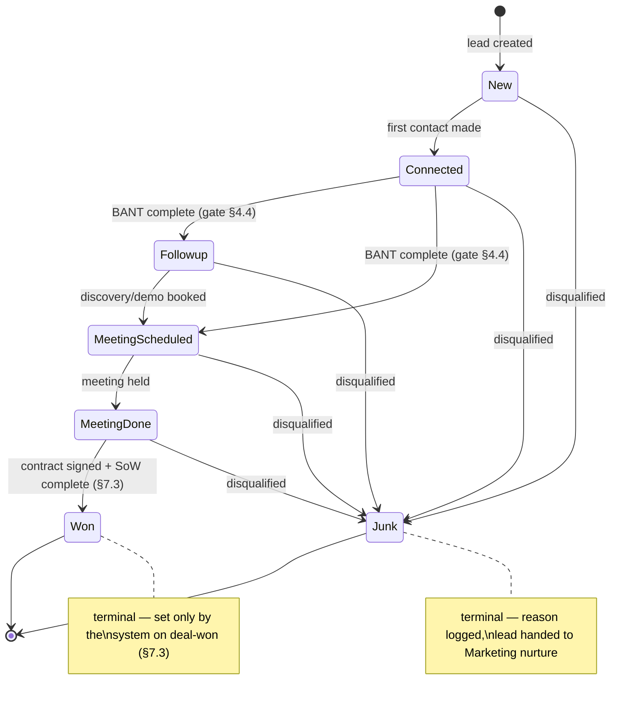

# 04 — Functional Specification: Sales Chain

**Product:** Zogency — multi-tenant, white-label agency CRM SaaS (tenant #1: BRB Digital)
**Covers:** PRD Module 1 (FR-1.1–1.7), Module 2 (FR-2.1–2.21), Module 5 (FR-5.1–5.5)
**Operationalizes:** SOP-SLS-01 (End-to-End Sales Process), steps 1–18
**Related docs:** [02-technical-architecture.md](02-technical-architecture.md) (topology, webhook intake, adapter ports, ADR-004), [03-data-model-erd.md](03-data-model-erd.md) (schema contract — all entity/field names in this spec are defined there), [11-open-questions-and-risks.md](11-open-questions-and-risks.md) (Q1, Q2, Q6, Q7, Q10)

---

## 1. Scope & overview

This spec defines the Sales chain: everything from a lead arriving (webhook, form, manual, CSV) through qualification, calling, proposal, closing, and the automated handover that creates a client, a delivery project, and an onboarding checklist. It ends where the Delivery and Retention specs begin (SOP steps 19–21 are covered in doc 07).

Per **ADR-004** (doc 02 §10), the chain is modeled as a **lead + deal split**: `leads` carry the 7-status journey; a `deals` row is created when BANT qualification completes and carries value, forecast, proposal linkage, and stage (`open / verbal_commit / won / lost`). There is no "Lost" lead status (doc 11 Q6): a dead opportunity is recorded as `deals.stage = lost` with a mandatory `lost_reason`; the lead may then be set to Junk or left for re-nurture. All deal events render on the lead's single timeline, preserving the PRD's one-timeline UX.

### SOP-SLS-01 step mapping

| SOP step | SOP activity | Spec section | Primary FRs |
|---|---|---|---|
| 1 | Capture leads | §2 Lead ingestion | FR-1.1–1.4, 1.7 |
| 2 | Assign ownership | §3 Assignment engine | FR-1.5, 1.6 |
| 3 | Initial outreach within SLA | §4 (Connected), §5 (calling, SLA) | FR-2.1–2.5 |
| 4 | Qualify (BANT) | §4.4 BANT gate | FR-2.10 |
| 5 | Update CRM stage / disqualify | §4 status workflow (Follow-up / Junk) | FR-2.6–2.9 |
| 6 | Discovery call | §6.1 discovery notes | FR-2.11 |
| 7–8 | Solution mapping, demo | §4 (Meeting Scheduled / Meeting Done) | FR-2.6 |
| 9 | Prepare proposal | §6.2 templates | FR-2.12 |
| 10 | Internal pricing approval | §6.3 discount approval | FR-2.13 |
| 11 | Send proposal (date + version) | §6.2 versioning | FR-2.14 |
| 12 | Objections & negotiation | §6.4 revision history | FR-2.15 |
| 13 | Verbal commitment | §7.1 deals.stage = verbal_commit | FR-2.16 |
| 14 | Contract / PO execution | §7.2 e-signature | FR-2.17 |
| 15 | Mark Closed-Won | §7.3 Won + SoW validation | FR-2.18, FR-5.2/5.3 |
| 16 | Process the order | §7.5 Finance submission | FR-2.19 |
| 17 | Internal handover | §7.4 handover + notifications | FR-2.20, FR-5.1/5.4/5.5 |
| 18 | Confirm kickoff | §7.4 kickoff auto-scheduling | FR-2.21 |

## 2. Lead ingestion (FR-1.1–1.4, FR-1.7)

All ingestion channels converge on one domain function, `leads.service.createLead()`, which performs dedupe, source tagging, SLA stamping, and (in the same job) assignment (§3). Webhook channels follow the intake pattern of doc 02 §6.1: verify → persist raw payload to `webhook_events` (append-only) → 200 within 2s → enqueue BullMQ job → worker parses, dedupes, creates the lead, runs assignment, notifies, marks the event `processed` (or `failed` with error, retry with backoff). Failed events are replayable from the raw payload.

### 2.1 Channels

| Channel | FR | Mechanism |
|---|---|---|
| Meta Lead Ads | FR-1.1 | `POST /api/webhooks/meta` — hub challenge + `X-Hub-Signature-256` verification; `leadgen` field of the page subscription; worker fetches full lead detail via Graph API using tenant `integration_credentials`; `webhook_events.external_id` = Meta `leadgen_id` |
| Google Lead Form Extensions | FR-1.2 | `POST /api/webhooks/google` — per-tenant `google_key` token verification; payload carries form/campaign ids and `lead_id` → `external_id` |
| Website form | FR-1.3 | `POST /api/webhooks/website-form` — per-tenant public form key; rate-limited; honeypot field; same event → job pipeline |
| Manual entry | FR-1.3 | "New lead" form in the app (server action, permission `leads.create`): name, phone, email, company, city, industry, source. Synchronous create; assignment still runs (a manually chosen owner overrides the rules). |
| CSV import | FR-1.3, R6, R10 | Upload → column-mapping screen → validation preview (per-row errors) → queued import job creating one lead per row through the same `createLead()` path. Serves both the ongoing API-outage fallback (PRD §20) and the **BRB legacy data migration** (doc 11 R10): an `imported_at_status` column may place migrated leads directly into a non-New status, writing the corresponding `lead_status_history` rows with an import-attributed comment. |

Mapped via the `AdsLeadSourcePort` adapters (Meta, Google, WebsiteForm, CsvImport — doc 02 §6.2). Sprint 2 must ship CSV + website-form ingestion first; Meta/Google webhooks attach when API approvals land (doc 11 R1).

### 2.2 Dedupe (FR-1.4)

- Enforced by the tenant-scoped partial unique indexes on `leads`: `(tenant_id, phone) WHERE phone IS NOT NULL` and `(tenant_id, email) WHERE email IS NOT NULL` (doc 03 §7). Phone numbers are normalized to E.164 before comparison; emails lowercased.
- On duplicate match, the system must **not** create a new lead. Instead it appends a `comments` row on the **existing** lead ("Duplicate submission from {source} on {date}; payload merged") and links the new `webhook_events` row to that lead. Any non-empty fields absent on the existing lead (e.g. company, city) are merged in; existing values are never overwritten.
- If the existing lead is terminal (Won or Junk), the merge note flags it for owner review ("possible re-engagement") and notifies the current owner; no status change is made automatically.
- `webhook_events` dedupe on `(tenant_id, source, external_id)` guards against provider redelivery independently of lead-level dedupe.

### 2.3 MQL / SQL tagging (FR-1.7)

Every lead references a `lead_sources` row (`type`, `name`, `campaign_ref`, `is_mql`). Sources of type `meta`/`google` (and any source flagged by Admin) carry `is_mql = true`; directly sourced channels (cold_call, linkedin, referral, event) default to `is_mql = false` (SQL-path). The MQL/SQL distinction is a report dimension (FR-9.1) and a filter on the pipeline board — it does not change workflow rules.

### 2.4 Screens

- **Lead list / Kanban board** — leads by status column (from `lead_statuses`), filterable by owner, source, MQL/SQL, city; card shows name, company, source badge, SLA countdown.
- **New lead form** — manual entry (§2.1).
- **CSV import wizard** — upload, mapping, validation preview, import progress, per-row error report.

## 3. Assignment engine (FR-1.5, FR-1.6)

### 3.1 Rules

`assignment_rules` rows (Admin-editable, permission `settings.manage`): `strategy(round_robin / territory / product_line / account_size)`, `criteria` (jsonb — e.g. city list for territory, service interest for product line, value band for account size), `target_user_ids`, `priority`, `enabled`.

Evaluation, executed by the worker **in the same job as lead creation** (doc 02 §8 — this is what makes the <1-minute NFR achievable):

1. Load enabled rules ordered by `priority` ascending.
2. First rule whose `criteria` match the lead wins; within the rule, `round_robin` cycles `target_user_ids` (last-assigned pointer kept in Redis per rule), other strategies resolve deterministically from criteria.
3. If no rule matches, fall back to a tenant-default round-robin over users holding the Sales Rep role; if that is empty, assign to the Sales Manager and raise an in-app alert.
4. Write a `lead_assignments` row (`lead_id, assignee_id, assigned_by = null` for system, `rule_id`, `at`) and set `leads.owner_id`. `lead_assignments` is append-only — the latest row is the current owner; the full chain is the reassignment history.

### 3.2 Manual reassignment

Users with permission `leads.reassign` (seeded to Sales Manager, Admin) may reassign any lead: appends a `lead_assignments` row with `assigned_by` = actor and `rule_id = null`, requires a reason comment (same modal pattern as §4.2), and notifies both old and new owners.

### 3.3 Notification (FR-1.6)

On every assignment the system must instantly notify the assignee via `notifications`: **in-app** (always) plus **WhatsApp and email** (via `MessagingPort` / `EmailPort`, template `lead_assigned` from `message_templates` with lead name, source, phone, deep link). WhatsApp failure (template not yet approved, provider error) must not fail the job — it degrades to email + in-app and logs the delivery error on the notification row (doc 11 R12).

### 3.4 NFR

Lead-to-assignment must complete in **< 1 minute**, measured `webhook_events.received_at → lead_assignments.created_at`; p95 monitored with an alert at > 60s (doc 02 §8). Manual/CSV-created leads are measured from `leads.created_at` instead.

## 4. 7-status workflow (FR-2.6–2.10)

### 4.1 Statuses

The seven statuses live in the tenant-scoped `lead_statuses` table (**not** a DB enum), seeded per tenant: New, Connected, Follow-up, Meeting Scheduled, Meeting Done, Junk, Won — with `sort, is_terminal, is_won, is_junk, color`. Only Admin (permission `settings.manage`) may edit the set (FR-2.6); workflow code branches on the `is_won` / `is_junk` / `is_terminal` flags, never on names, so renames are safe.



Rules:
- Forward transitions follow the diagram; **Junk is reachable from any non-terminal status** and always bypasses the BANT gate.
- Backward moves (e.g. Meeting Scheduled → Follow-up when a meeting is cancelled) are allowed between non-terminal statuses; the mandatory comment records why.
- Won and Junk are terminal: no transitions out. Reopening a junked lead is an Admin-only action that appends a new history row (never edits old ones).
- **Won cannot be set directly by a user.** It is applied by the system as part of the deal-won transaction (§7.3). The UI hides Won from the status picker.
- Junk requires a `junk_reason` (stored on `leads.junk_reason` in addition to the comment); junked leads are surfaced to Marketing for nurture (SOP step 5).

### 4.2 Mandatory comment on every status change (FR-2.7–2.9)

Every status change — regardless of actor or channel — must open a **comment modal that cannot be skipped** (no empty submit, no dismiss-and-apply). Server-side, the transition is one transaction that inserts:

1. a `comments` row (`body`, `entity_type='lead'`, `entity_id`, `author_id`), and
2. a `lead_status_history` row (`lead_id, from_status_id, to_status_id, comment_id NOT NULL, actor_id, at`) referencing it.

Both tables are **append-only** (doc 03 §3): no UPDATE/DELETE in the domain layer, DB trigger backstop, corrections via a new row with `supersedes_id`. Every entry is timestamped and attributed (FR-2.8). System-initiated transitions (Won on deal-won, CSV import placement) write a system-attributed comment with the triggering context. The comment requirement is enforced in the service layer so API/automation paths cannot bypass it.

### 4.3 Single chronological timeline (FR-2.9)

The lead detail page renders **one merged, chronological timeline** interleaving:
- status changes (from `lead_status_history`, each with its comment),
- free-standing `comments`,
- `calls` (with duration, disposition, recording player when present),
- deal events (deal created, stage changes incl. verbal_commit/won/lost, from `audit_logs` on `deals`),
- proposal events (`proposal_versions.sent_at` entries),
- assignment changes (`lead_assignments`),
- SLA escalations (`sla_escalations`).

Backed by the indexes in doc 03 §7. The timeline is read-only history; new entries only ever append.

### 4.4 BANT gate (FR-2.10, doc 11 Q7)

`bant_qualifications` is 1:1 with the lead: `budget_range, authority (role/contact), need, timeline, qualified_by, qualified_at`. The gate is pinned to the **Connected → forward** transition: a lead cannot leave Connected for **any forward status** (Follow-up or Meeting Scheduled) until all four BANT fields are complete. **Junk is always allowed.** The status picker shows the blocked options as disabled with an inline "Complete BANT to proceed" link opening the BANT form; the server enforces the same rule. Completing BANT also **creates the `deals` row** (stage `open`, `lead_id`, `owner_id` = lead owner) per ADR-004 — qualification is the lead→opportunity moment.

### 4.5 Status permission matrix

| Transition | Sales Rep (owner) | Sales Manager | Admin | System |
|---|---|---|---|---|
| New → Connected | Yes | Yes | Yes | — |
| Connected → Follow-up / Meeting Scheduled (BANT complete) | Yes | Yes | Yes | — |
| Follow-up → Meeting Scheduled | Yes | Yes | Yes | — |
| Meeting Scheduled → Meeting Done | Yes | Yes | Yes | — |
| Any backward move (non-terminal) | Yes | Yes | Yes | — |
| Any non-terminal → Junk | Yes | Yes | Yes | — |
| Meeting Done → Won | No | No | No | **Only** via deal-won (§7.3) |
| Reopen from Junk | No | No | Yes | — |
| Edit status set (`lead_statuses`) | No | No | Yes | — |

"Sales Rep (owner)" means the current assignee; reps may not change statuses of leads they don't own unless they hold `leads.manage_all` (seeded to Sales Manager/Admin).

## 5. IVR calling (FR-2.1–2.5)

### 5.1 Click-to-call (FR-2.1, FR-2.2)

The lead record shows a **Call** button — no external dialer. It invokes `TelephonyPort.clickToCall()` (vendor pending, doc 11 Q1: Exotel / Knowlarity / Ozonetel / MyOperator; adapter chosen per tenant from `integration_credentials`). Flow:

```
1. User clicks Call → server action creates a `calls` row
   (lead_id, user_id, provider, direction='outbound', started_at, is_manual_log=false)
   and calls TelephonyPort.clickToCall(rep_number, lead_phone)
2. Provider bridges rep ↔ lead; provider_call_id stored on the row
3. Provider posts call events to POST /api/webhooks/ivr
   → webhook_events (raw, append-only) → 200 → queued job
4. Worker (TelephonyPort.parseCallEvent) finalizes the call row:
   duration_sec, disposition (answered/no_answer/busy/failed), outcome fields
   — `calls` is append-mostly: created at dial time, finalized once, then immutable
5. Worker fetches the recording (TelephonyPort.getRecordingUrl), downloads it to
   object storage under recordings/ (≥12-month lifecycle, doc 02 §7), creates a
   `files` row, sets calls.recording_file_id
```

- FR-2.3: every provider call is recorded automatically and the recording attached to the lead timeline; playback via short-lived signed URLs, permission-gated (`calls.listen_recording`).
- FR-2.4: duration, time, and outcome are auto-captured from the provider callback — never hand-typed for IVR calls. The rep may add an `outcome_note` after the call (saved synchronously; **call-log save < 2s** NFR — recording fetch is deferred to the worker).
- A consent notice must play at call start on the IVR flow (DPDP, doc 11 R8).

### 5.2 Manual call-log fallback (PRD §20 risk mitigation)

Always available regardless of vendor status (ManualLog adapter, doc 02 §6.2): a "Log call" form on the lead record capturing direction, started_at, duration, disposition, outcome note → `calls` row with `is_manual_log = true` (no recording). Manual logs count toward the first-contact SLA.

### 5.3 First-contact SLA & escalation (FR-2.5)

- On lead creation, `leads.sla_due_at = created_at + tenant_settings.sla_hours` (seed default 24h, tenant-configurable).
- `leads.first_contacted_at` is set by the first `calls` row (any disposition where a connection attempt was made — configurable whether `no_answer` counts; default: only `answered` counts) or by the New → Connected status change, whichever comes first.
- A worker sweep (index `(tenant_id, sla_due_at) WHERE first_contacted_at IS NULL`, doc 03 §7) runs every 5 minutes; on breach it inserts an `sla_escalations` row (`entity_type='lead'`, `breached_at`, `escalated_to` = Sales Manager) and notifies the Sales Manager (in-app + WhatsApp/email) and the assignee. Escalations appear on the timeline and in the manager's dashboard; `resolved_at` set when first contact finally occurs.

## 6. Discovery, proposal & negotiation (FR-2.11–2.15)

All entities in this section hang off the `deals` row created at qualification (§4.4).

### 6.1 Discovery notes (FR-2.11)

Structured form on the deal (SOP step 6), stored as append-only `discovery_notes`: `business_challenges, requirements, budget_notes, decision_timeline, author_id`. Multiple notes per deal are allowed (one per discovery/demo call); corrections append a superseding row. Notes render on the lead timeline.

### 6.2 Proposal templates & versioning (FR-2.12, FR-2.14)

- `proposal_templates` (Admin-editable): `service_line, name, body_file_id/template_ref, active` — one reusable template per service line (SOP step 9), linked to `service_catalog` entries.
- A proposal is `proposals` (parent: `deal_id, current_version, status(draft/sent/revised/accepted)`) + immutable `proposal_versions` (`version_no, amount, document_file_id, sent_at, sent_by, change_note`). **Sending a proposal always creates a new version row** with `sent_at` and the generated PDF (server-side, white-label per tenant branding) — this is the FR-2.14 date+version log. Versions are never edited or deleted.

### 6.3 Discount approval routing (FR-2.13, doc 11 Q10)

The pricing band is **tenant config** (Q10 — BRB's actual Discount & Approval Matrix values still needed): per-service-line standard price band + maximum rep discount %, stored in `tenant_settings` / `service_catalog.price_band`.

- When a proposal version's `amount` falls outside the configured band for its service line, the system creates an `approval_requests` row (`type='discount'`, `entity_type='proposal'`, `entity_id`, `requested_by`, `approver_id` = Sales Manager, `state='pending'`) — the generic approval workflow shared across modules.
- **A proposal cannot be sent while a discount approval is pending or rejected.** The Send action is blocked server-side; the UI shows the approval state inline. On `approved`, sending unblocks; the decision (`decision_note`, `decided_at`) is recorded and audit-logged.
- Re-editing the amount after approval invalidates the approval (new request required) — approvals bind to the specific amount.

### 6.4 Objections & revision history (FR-2.15)

Negotiation is captured with no extra machinery: each revised offer is a new `proposal_versions` row (`change_note` = what changed and why), and objections/discussion are `comments` on the deal, all interleaved on the timeline. Approved pricing bands stay enforced on every version via §6.3 — a revision outside the band re-routes for approval before it can be sent.

### 6.5 Screens

- **Deal panel** (on lead detail) — value, stage, expected close, discovery notes, proposals list with version history, approval state badges.
- **Proposal composer** — pick template, edit line items/amount, preview PDF, Send (gated by §6.3).
- **Approvals inbox** (Sales Manager) — pending `approval_requests` with one-click approve/reject + decision note.

## 7. Closing, order processing & handover (FR-2.16–2.21, FR-5.1–5.5)

### 7.1 Verbal commit (FR-2.16)

Deal stage picker allows `open → verbal_commit` (SOP step 13), owner or manager, with a comment. Verbal-commit deals are highlighted in the pipeline/forecast view. `verbal_commit → open` (fell through) and `→ lost` are allowed.

### 7.2 Contract execution (FR-2.17)

- "Send contract" on a verbal-commit deal creates a `contracts` row (1:1 deal) and calls `ESignPort.createEnvelope()` (vendor pending — Zoho Sign recommended, doc 11 Q2). Status flow: `draft → sent → signed / declined`, driven by e-sign webhook events (`/api/webhooks/esign` → `webhook_events` → worker → `ESignPort.parseSignedEvent`).
- **LoggedApproval fallback** (always available): a user with `deals.close` records `provider='logged'` with the signed document / written-approval evidence uploaded as `document_file_id` and `signed_at` set manually. The actor and evidence are audit-logged.

### 7.3 Deal won — hard validation & the Won transaction (FR-2.18, FR-5.2, FR-5.3)

When the contract reaches `signed` (webhook or logged), the deal becomes *eligible* for Won. Marking Won (system-driven; surfaced to the rep as a "Complete handover & close" flow) requires, as **hard server-side validation**:

1. `contracts.status = 'signed'` (or logged approval recorded);
2. deal `value` and `final_terms` recorded (FR-2.18);
3. a `handovers` row exists with `account_context`, `commitments`, `key_contacts_note` completed (FR-2.20 structured handover form);
4. **at least one `sow_deliverables` line item exists, and every item has `service_id` (service), `description`, `quantity`, `frequency`, and `deadline` populated** (FR-5.2/5.3; doc 11 R5 — deliverables are individual trackable line items, never a paragraph).

If any check fails, Won is blocked with a checklist of what's missing. When all pass, one transaction:

- sets `deals.stage = 'won'`, `won_at`;
- appends the lead's status change to **Won** with a system comment referencing the deal and contract (§4.1 — the only path to lead-Won);
- executes the handover automation of §7.4.

Losses at any stage: `deals.stage = 'lost'` with mandatory `lost_reason` (doc 11 Q6); the lead keeps its 7-status value (optionally junked).

### 7.4 Automated handover (FR-5.1, FR-5.4, FR-5.5, FR-2.21)

Within the won transaction (or its immediately-enqueued job), the system must:

1. **Auto-create the `clients` row** (FR-5.1): `origin_lead_id`, `origin_deal_id`, `owner_id`, contact details copied to `client_contacts` (primary = lead contact; additional contacts from the handover form). The client record links the **full lead-to-Won history** — timeline, calls/recordings, BANT, discovery notes, proposal versions, contract — via the origin references; nothing is copied or lost.
2. **Auto-create the delivery project** (`projects` row, FR-6.1/FR-10.3): `client_id`, `handover_id`, type retainer/one-off from the deal terms. `sow_deliverables` become the seed for delivery tasks (doc 06).
3. **Generate the onboarding checklist** (FR-5.4): for each distinct service sold (the `service_id`s on the SoW line items), instantiate the matching `onboarding_templates` into `onboarding_checklist_items` (`client_id, template_item_ref, title, assignee_id, due_on`). Templates are Admin-editable per service.
4. **Notify the relevant department(s)** (FR-5.5): departments derived from the services sold; notification (in-app + email) carries the handover summary with the **lead/call history and SoW attached** — a generated handover PDF plus deep links.
5. **Auto-schedule the kickoff call** (FR-2.21, SOP step 18): create a calendar event via `CalendarPort.createEvent()` (Google Calendar) within the tenant-configured kickoff window (`tenant_settings`, seed default: 3 business days), inviting the client primary contact, the rep, and the delivery owner; store `handovers.kickoff_scheduled_at` and `kickoff_event_ref`. If the calendar integration is unavailable, create a due-dated task for Customer Success instead and flag the handover.

Target: same-day handoff (PRD §22) — steps 1–5 are fully automatic; only the SoW/handover form content is human input, and it was mandatory *before* Won.

### 7.5 Order processing to Finance (FR-2.19)

On Won, the system submits order details to Finance (SOP step 16): auto-create a draft `invoices` row (`client_id`, `project_id`, `invoice_line_items` generated from `sow_deliverables` — description, qty, rate from the accepted proposal amount/terms) and notify the Finance role for pricing validation and issue. Invoice issue, GST fields, payment tracking, and accounting sync are specified in doc 07; this spec ends at the draft-invoice creation + notification.

### 7.6 Screens

- **Close & handover wizard** — stepper: contract status → deal value/terms → handover form → SoW line-item editor (add/edit rows: service, description, quantity, frequency, deadline) → validation summary → confirm Won.
- **Client record** — created on Won; header links back to origin lead/deal; tabs for contacts, onboarding checklist, projects, invoices.
- **Onboarding checklist view** — items with assignee, due date, done toggle (sets `done_at`).

## 8. Acceptance criteria

**Ingestion (§2)**
- A Meta/Google webhook POST receives HTTP 200 in < 2s and always produces a `webhook_events` row, even for malformed payloads (which end `failed` with an error, replayable).
- Submitting the same external lead twice (same `external_id`, or same normalized phone/email) results in exactly one `leads` row; the second delivery adds a merge comment on the existing lead.
- A lead from a `meta` source has `lead_sources.is_mql = true`; a cold-call lead has `false`; both are filterable on the board.
- CSV import of N valid rows creates N leads through the same dedupe/assignment path; invalid rows are reported per-row without aborting the batch; an import can place migrated leads into a non-New status with history rows written.

**Assignment (§3)**
- Given rules with priorities [10 territory, 20 round_robin], a lead matching the territory criteria is assigned by rule 10; a non-matching lead falls through to rule 20; with no rules, fallback round-robin over Sales Reps applies.
- Every assignment produces an append-only `lead_assignments` row; `assigned_by` is null for system assignments and the actor's id for manual reassigns; reassign requires `leads.reassign` and a reason comment.
- Assignee receives in-app + WhatsApp/email notification; WhatsApp failure does not fail the job.
- p95 of (`lead_assignments.created_at` − `webhook_events.received_at`) < 60s under normal load; breach alerts fire.

**Status workflow (§4)**
- The status picker offers only transitions valid per §4.1/§4.5; the server rejects invalid transitions submitted directly.
- No status change can be persisted without a non-empty comment; the resulting `lead_status_history` row has `comment_id NOT NULL`; attempts to UPDATE or DELETE either table raise (trigger backstop).
- A lead in Connected with incomplete BANT cannot move to Follow-up or Meeting Scheduled (UI disabled + server rejection) but can move to Junk; completing BANT unblocks and creates a `deals` row with stage `open`.
- No user-facing path sets Won directly; Won appears on a lead only via the §7.3 transaction.
- The lead detail timeline shows status changes, comments, calls, deal events, proposal sends, assignments, and escalations in one chronological stream.
- A non-Admin cannot edit `lead_statuses`; Admin can rename/recolor without breaking Won/Junk behavior (flag-driven).

**Calling (§5)**
- Click-to-call creates a `calls` row at dial time; the provider callback finalizes duration/disposition exactly once; the row is immutable afterward.
- A completed IVR call shows a playable recording on the timeline within the worker's fetch cycle; the file lives in object storage under a ≥12-month lifecycle and is served only via signed URL to permitted users.
- Manual call log saves in < 2s, appears on the timeline flagged as manual, and sets `first_contacted_at`.
- A lead uncontacted past `sla_due_at` produces exactly one `sla_escalations` row and notifies the Sales Manager; the escalation resolves when contact occurs.

**Discovery & proposal (§6)**
- Discovery notes save with all four structured fields and render on the timeline; edits append superseding rows.
- Sending a proposal creates an immutable `proposal_versions` row with `sent_at`, `amount`, `version_no`, and the PDF; sending again after edits creates version n+1 with a `change_note`.
- A proposal priced outside the tenant band cannot be sent: the Send action is server-blocked until the linked `approval_requests` row is `approved`; changing the amount after approval re-requires approval.
- The full negotiation history (all versions + comments) is reconstructible from append-only data.

**Closing & handover (§7)**
- A deal can be moved to `verbal_commit` and back; `lost` always requires a reason; lost deals appear in pipeline reports while the lead keeps a valid 7-status value.
- The e-sign webhook drives `contracts.status` to `signed`; the logged-approval fallback requires an evidence file and is audit-logged.
- Won is rejected if: contract unsigned, value/terms missing, handover form incomplete, zero SoW items, or any SoW item missing service/description/quantity/frequency/deadline — with a precise missing-items list.
- A successful Won atomically produces: `deals.stage='won'` + lead status Won (system comment) + `clients` row (with origin links and contacts) + `projects` row + onboarding checklist items matching the services sold + department notifications with SoW/history attachment + kickoff calendar event (or fallback task) + draft invoice + Finance notification.
- Re-running a failed handover job is idempotent (no duplicate client/project/checklist).

## 9. Traceability matrix

Sprints per doc 10 labels: **S2** leads · **S3** pipeline · **S4** calling · **S5** deal room · **S6** handover.

| FR | Requirement (short) | Spec § | Entities | Sprint |
|---|---|---|---|---|
| FR-1.1 | Meta Lead Ads webhook ingestion | §2.1 | webhook_events, leads, lead_sources | S2 |
| FR-1.2 | Google Lead Form ingestion | §2.1 | webhook_events, leads, lead_sources | S2 |
| FR-1.3 | Inbound/outbound channel capture (website, manual, CSV) | §2.1 | leads, lead_sources, webhook_events | S2 |
| FR-1.4 | Phone/email dedupe before queueing | §2.2 | leads (partial unique idx), webhook_events, comments | S2 |
| FR-1.5 | Auto-assignment by territory / product line / account size | §3.1–3.2 | assignment_rules, lead_assignments, leads | S2 |
| FR-1.6 | Instant assignee notification (in-app + WhatsApp/email) | §3.3 | notifications, message_templates | S2 |
| FR-1.7 | MQL vs SQL source tagging | §2.3 | lead_sources (is_mql) | S2 |
| FR-2.1 | IVR/cloud telephony integration | §5.1 | calls, integration_credentials | S4 |
| FR-2.2 | Click-to-call from lead record | §5.1 | calls | S4 |
| FR-2.3 | Auto-record calls, attach to timeline | §5.1 | calls, files | S4 |
| FR-2.4 | Auto-capture duration/time/outcome | §5.1 | calls | S4 |
| FR-2.5 | First-contact SLA + manager escalation | §5.3 | leads (sla_due_at), sla_escalations, tenant_settings | S4 |
| FR-2.6 | Exactly 7 statuses, Admin-editable only | §4.1 | lead_statuses | S3 |
| FR-2.7 | Mandatory comment on every status change | §4.2 | comments, lead_status_history | S3 |
| FR-2.8 | Timestamp + attribution on changes | §4.2 | lead_status_history, comments | S3 |
| FR-2.9 | Single chronological timeline | §4.3 | lead_status_history, comments, calls, lead_assignments, sla_escalations, audit_logs | S3 |
| FR-2.10 | BANT gate before Connected → forward | §4.4 | bant_qualifications, deals | S3 |
| FR-2.11 | Structured discovery notes | §6.1 | discovery_notes, deals | S5 |
| FR-2.12 | Proposal templates per service line | §6.2 | proposal_templates, service_catalog | S5 |
| FR-2.13 | Discount approval routing | §6.3 | approval_requests, tenant_settings, service_catalog | S5 |
| FR-2.14 | Proposal logged with date + version on send | §6.2 | proposals, proposal_versions, files | S5 |
| FR-2.15 | Objection/revision history within pricing bands | §6.4 | proposal_versions, comments, approval_requests | S5 |
| FR-2.16 | Verbal Commit stage | §7.1 | deals (stage) | S5 |
| FR-2.17 | E-signature integration + fallback | §7.2 | contracts, webhook_events, files | S5 |
| FR-2.18 | Closed-Won with value + key terms | §7.3 | deals (value, final_terms, won_at) | S5 |
| FR-2.19 | Order details to Finance for invoicing | §7.5 | invoices, invoice_line_items, notifications | S6 |
| FR-2.20 | Structured handover form | §7.3–7.4 | handovers, client_contacts | S6 |
| FR-2.21 | Auto-schedule kickoff call | §7.4 | handovers (kickoff_event_ref), CalendarPort | S6 |
| FR-5.1 | Auto-create client merging full lead history | §7.4 | clients, client_contacts | S6 |
| FR-5.2 | Structured SoW at handover | §7.3 | handovers, sow_deliverables | S6 |
| FR-5.3 | Deliverables as individual trackable line items | §7.3 | sow_deliverables | S6 |
| FR-5.4 | Onboarding checklist from services sold | §7.4 | onboarding_templates, onboarding_checklist_items | S6 |
| FR-5.5 | Departments auto-notified with history + SoW | §7.4 | notifications, departments, files | S6 |

**Open dependencies:** Q1 IVR vendor (blocks S4 adapter choice, not the port/manual fallback) · Q2 e-sign vendor (S5) · Q5 BRB roster + assignment rule values (S2 seed) · Q10 discount matrix values (S5 config seed) · Q6/Q7/Q8 confirmations at sign-off (doc 11 §2).
