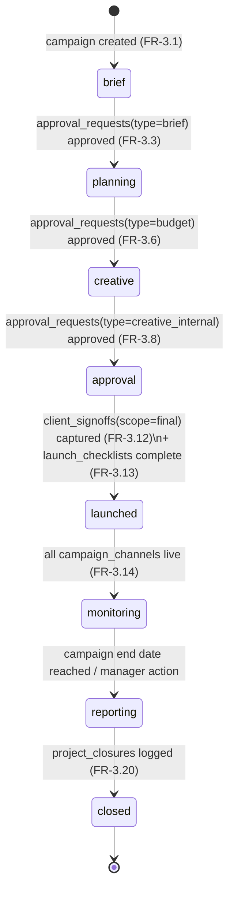

# 05 — Functional Spec: Marketing / Campaign Chain (Module 3)

**Product:** Zogency — multi-tenant, white-label agency CRM SaaS (tenant #1: BRB Digital)
**Covers:** PRD Module 3, FR-3.1–FR-3.20 · Operationalizes **SOP-MKT-01** (Client & Campaign Project Management) 1:1
**Phase:** All requirements in this spec ship in **Phase 2** per the sprint plan (doc 10)
**Related docs:** [02-technical-architecture.md](02-technical-architecture.md) (adapter ports, worker, approval workflow), [03-data-model-erd.md](03-data-model-erd.md) §4.4/§5.4 (entities), [11-open-questions-and-risks.md](11-open-questions-and-risks.md) (Q11 revision limit, Q13 no client portal, O3 ads-API sync)

---

## 1. Scope & overview

This spec defines the campaign chain: everything from a brief arriving at Account Servicing to a formally closed, archived campaign. The CRM **enforces** SOP-MKT-01 rather than documenting it — each SOP step is a gated workflow state, a required form, or an automated action.

### 1.1 SOP-MKT-01 mapping

| SOP phase | SOP steps | FRs | Spec section |
|---|---|---|---|
| 5.1 Briefing & Requirement Gathering | 1–3 | FR-3.1–3.3 | §2 |
| 5.2 Campaign / Project Planning | 4–6 | FR-3.4–3.6 | §3 |
| 5.3 Creative & Content Development | 7–9 | FR-3.7–3.9 | §4 |
| 5.4 Approvals | 10–12 | FR-3.10–3.12 | §5 |
| 5.5 Execution & Launch | 13–15 | FR-3.13–3.15 | §6 |
| 5.6 Monitoring & Optimization | 16–17 | FR-3.16–3.17 | §7 |
| 5.7 Reporting & Project Closure | 18–20 | FR-3.18–3.20 | §8 |

### 1.2 Campaign record & lifecycle

The hub entity is **campaigns** (doc 03 §5.4). Key structural rules:

- `campaigns.client_id` is **nullable**: set → client work (brief received via handover or directly from the client); null → **internal project** (internal brand work, content production — SOP-MKT-01 §2 explicitly covers both). All gates apply identically; for internal projects the "client" sign-off party is the internal stakeholder, captured through the same mechanisms.
- `campaigns.status` is a DB enum (doc 03 §6): `brief → planning → creative → approval → launched → monitoring → reporting → closed`. Transitions are forward-only via gate checks below; Admin (permission `campaigns.force_status`) may move a campaign backward one step with a mandatory comment (audit-logged).
- `campaigns.manager_id` (Marketing Manager — approver) and `campaigns.account_owner_id` (Account Servicing — client-facing owner) are required at creation.
- The system must render every campaign event (brief versions, approvals, revision rounds, sign-offs, go-lives, optimizations) on one chronological campaign timeline, mirroring the lead-timeline UX.

Gate enforcement lives in `src/modules/campaigns/service.ts` — a single `transitionCampaign(campaignId, toStatus)` function that validates the gate for each edge and rejects otherwise. UI status controls are convenience only; the service is the boundary.

## 2. Briefing & requirement gathering (FR-3.1–3.3 · SOP Steps 1–3)

### 2.1 Brief intake — FR-3.1

- The system must provide a structured brief-intake form creating a **briefs** parent + first **brief_versions** row with required fields: `objectives`, `target_audience`, `deliverables`, `timeline`, `budget_estimate` (per doc 03 §5.4). Submitting the form creates the campaign in status `brief` if one does not exist.
- Briefs are **versioned** ([V] pattern, doc 03 §3): edits after the first save must create a new `brief_versions` row with a change note; versions are immutable and listed newest-first with a diff view. `briefs.current_version` points at the latest.
- A campaign must have exactly one brief; the brief screen is the campaign's landing tab while status = `brief`.
- Attachments (client decks, reference material) attach via **files** (`entity_type = 'brief_version'`).

### 2.2 Kickoff / clarification call — FR-3.2

- The system must let Account Servicing schedule a kickoff/clarification call from the campaign: creates a calendar event through **CalendarPort** (`createEvent()` — Google Calendar adapter, doc 02 §6.2) with attendees, and logs the event reference against the campaign.
- The call is also represented as a **tasks** row (`campaign_id` set, type kickoff) assigned to the account owner, so it appears on task boards and capacity views.
- Call outcome notes are logged as **comments** on the campaign (append-only). Held/not-held state is visible on the campaign timeline.
- The kickoff call is recommended, not a hard gate — a brief for a small internal project may skip it (the brief-approval screen shows a "no kickoff logged" warning to the approver).

### 2.3 Internal brief sign-off gate — FR-3.3

- Moving `brief → planning` must be blocked until an **approval_requests** row with `type = brief`, `entity_type = 'brief_versions'`, `entity_id = <current version>` is `approved`.
- Submitting for approval routes to the campaign's `manager_id` (Marketing Manager). The approver sees the current brief version, version history, and kickoff notes; decision requires a `decision_note` on rejection.
- Rejection returns the brief to editing; the next submission creates a **new** brief version and a **new** approval request (requests are never reused across versions).
- On approval, the worker fires the seeded automation "brief signed off → notify Strategy team" (FR-10.3): **notifications** to users holding the Strategy role, and the system permits the `planning` transition.

**Screen:** Campaign → Brief tab: form + version history rail + approval status banner + "Submit for sign-off" action (permission `campaigns.submit_brief`).

## 3. Planning (FR-3.4–3.6 · SOP Steps 4–6)

### 3.1 Strategy workspace — FR-3.4

- The system must provide a strategy workspace writing to **campaign_strategies** (1:1 with campaign): `approach` (rich text), `audience_segments` (jsonb — repeatable segment cards: name, description, criteria), `key_messages` (list), `channel_mix` (jsonb — channel + role + est. split %).
- Editable by Strategy/Planning and Marketing Manager roles while status ∈ {planning, creative}; every edit is audit-logged (mutable-table pattern, doc 03 §3).

### 3.2 Project plan builder — FR-3.5

- The system must provide a plan builder writing **campaign_plans** (timeline bounds `start_on`/`end_on`, `resource_allocation` jsonb mapping departments/users → allocation) and child **plan_milestones** (`title, due_on, owner_id, status(pending/done/missed)`).
- Each milestone can spawn linked **tasks** (`campaign_id` set) on department boards — the same task infrastructure as Delivery (doc 03 §5.5); milestone status rolls up from its tasks when linked.
- The plan renders as a milestone timeline (simple Gantt-style list by `due_on`); overdue milestones are flagged and surface in the Marketing dashboard (FR-9.2).

### 3.3 Budget approval workflow — FR-3.6

- The system must capture a **budgets** row (1:1 campaign): `amount`, `currency`, `breakdown` jsonb (line items: category, description, amount — must sum to `amount`, validated).
- Submitting the budget creates **approval_requests** `type = budget` routed to the Marketing Manager. If `amount` exceeds the tenant-configurable threshold `tenant_settings.budget_finance_threshold`, a **second** approval request routes to a Finance-role user; both must be `approved`. Below the threshold, Marketing Manager approval alone suffices.
- `budgets.approval_request_id` links the (primary) request; approval state is denormalized onto the budget screen.
- **Execution is blocked until approved:** the `planning → creative` transition requires the budget approval chain complete. Editing an approved budget amount voids the approval (new approval request required) and, if status has advanced, flags the campaign header with "budget re-approval pending".

**Screens:** Campaign → Strategy tab; Plan tab (milestones + resourcing); Budget tab (breakdown editor + approval trail).

## 4. Creative & content development (FR-3.7–3.9 · SOP Steps 7–9)

### 4.1 Concept board — FR-3.7

- The system must provide a concept board of **creative_concepts** cards: `title, concept (rich text), direction, file_ids` (mood boards, sketches via **files**).
- `creative_concepts` is **append-only** [A] (doc 03 §3): concepts are never edited or deleted; a revised concept is a new row with `supersedes_id`, preserving the creative trail (PRD §18 record: "creative concepts and revision history").

### 4.2 Internal review gate — FR-3.8

- Before any creative is shared externally, an **approval_requests** row `type = creative_internal` (entity: the concept, or the asset set) must be `approved` by the Marketing Manager — checking brand alignment, quality, and adherence to the brief.
- The `creative → approval` status transition is blocked until at least one `creative_internal` approval is `approved` and every asset intended for client review has `status = internal_review` passed (see 4.3).
- The system must prevent marking any `creative_assets.status = client_review` unless a covering `creative_internal` approval exists — this is the hard "nothing shared externally without internal review" rule.

### 4.3 Asset production workspace — FR-3.9

- **creative_assets** rows: `type(copy/design/video/digital), title, current_file_id, status(draft/internal_review/client_review/approved)`, optional `task_id` linking the production task.
- **File versioning** uses the shared `files.version_of` self-reference chain — the same infrastructure as Delivery task files (FR-6.4, doc 02 §7). Uploading a new version sets `version_of` to the prior file and repoints `current_file_id`; the full chain renders as version history with download of any version.
- Asset status moves `draft → internal_review → client_review → approved`; only Marketing Manager (or delegate with `creative.approve_internal`) can pass `internal_review`.

**Screen:** Campaign → Creative tab: concept board (cards) + asset grid (thumbnail, type, status chip, version count).

## 5. Approvals (FR-3.10–3.12 · SOP Steps 10–12)

> **No client portal in Phase 1** (doc 11 Q13 — recommended and assumed here): clients never log in. Account Servicing shares assets out-of-band (email/WhatsApp/meeting) using share-ready file links; feedback and sign-offs are captured **into** the CRM by Account Servicing. A portal arrives with the Phase-3 SaaS layer.

### 5.1 Client review workflow — FR-3.10

- The system must let Account Servicing mark assets as shared for client review (asset status → `client_review`, timestamped, share note logged as a comment) and generate a consolidated review package (list of current asset versions, optionally exported as a single PDF/zip).
- Client feedback is captured per round (5.2). Feedback text may reference specific assets (`revision_rounds.asset_id` nullable — round-level or asset-level feedback).

### 5.2 Revision rounds & limit — FR-3.11

- Feedback is logged as **revision_rounds** — **append-only, numbered**: `round_no` (auto-incremented per campaign), `feedback`, `source(client/internal)`, `asset_id` (nullable), `logged_by`. Rounds are never edited or deleted.
- **Limit:** `campaigns.revision_limit` defaults from `tenant_settings` default revision-round limit (seeded **2**) and is overridable per client contract at campaign creation (doc 11 Q11). The campaign header must display a revision counter — e.g. "Round 2 of 2" — visible to all roles.
- **Over-limit:** logging a round where `round_no > revision_limit` requires a Marketing Manager override (an inline approval with mandatory note). The override must automatically create a **billable-change note**: a flagged comment on the campaign (`billable_change = true`) surfaced in a "Billable changes" list for invoicing follow-up (Module 8). Without the override, the round cannot be saved.

### 5.3 Final sign-off — FR-3.12

- The `approval → launched` transition must be blocked until a **client_signoffs** row with `scope = final` exists (append-only [A]).
- Two capture methods:
  - `method = esign`: envelope created through **ESignPort** (`createEnvelope()` — Zoho Sign/DocuSign adapter per doc 11 Q2); the signed-event webhook writes the sign-off row with the signed document as `evidence_file_id`.
  - `method = logged_written`: Account Servicing logs a written approval received by email/message; `evidence_file_id` is **mandatory** (email screenshot/PDF/forwarded .eml) plus `signed_by_contact_id` (client contact; for internal projects, the approving internal stakeholder user).
- Sign-offs cover the final approved asset versions; the sign-off record lists the asset/file-version IDs it covers, so later file changes after sign-off re-open the gate (any new asset version post-sign-off flags "sign-off stale — re-approval required").

**Screen:** Campaign → Approvals tab: revision-round log (numbered timeline), counter vs limit, sign-off capture form, evidence viewer.

## 6. Execution & launch (FR-3.13–3.15 · SOP Steps 13–15)

### 6.1 Pre-launch checklist — FR-3.13

- Each campaign gets a **launch_checklists** record with items seeded from a tenant template: at minimum `tracking` (pixels/UTMs/conversion setup), `scheduling` (posts/ads scheduled), `channel_readiness` (accounts, budgets loaded per channel), plus custom items.
- Each item records `checked_by, checked_at`. **All items must be checked** (and final sign-off present, §5.3) before the `approval → launched` transition is permitted. Unchecking after launch is not possible (items lock at launch).

### 6.2 Go-live scheduling — FR-3.14

- **campaign_channels** rows per channel: `channel(meta/google/social/email/other), go_live_at, status(scheduled/live/paused/ended)`.
- The system must display a go-live schedule board; Digital/Media marks each channel `live` at publication (Phase 2 launch execution is manual in-platform on the ad networks — the CRM tracks state, it does not publish).
- The campaign moves `launched → monitoring` automatically (worker) when all non-cancelled channels are `live`, or manually by the Marketing Manager.

### 6.3 Launch confirmation — FR-3.15

- On each channel go-live (status set to `live`), the worker must automatically: (a) create a **notifications** row (in-app + email) to the campaign's `account_owner_id`, and (b) create a **tasks** row "Confirm launch to client" assigned to the account owner with a same-day deadline.
- Completing that task closes the SOP-Step-15 loop; an incomplete confirmation task past deadline follows standard SLA escalation (FR-10.4).

## 7. Monitoring & optimization (FR-3.16–3.17 · SOP Steps 16–17)

### 7.1 KPI dashboard — FR-3.16

- **campaign_kpis** define the measures (`name(reach/ctr/conversions/custom), target`), set during planning (targets should trace to the brief's objectives). **kpi_snapshots** [A] hold the timeseries: `kpi_id, value, captured_at, source(manual/api)`.
- The campaign dashboard must chart each KPI's snapshots against target with latest-value tiles and a % -to-target indicator; it draws only from snapshots (precompute pattern, 3-second dashboard NFR).
- **Phase 2 entry is manual:** Digital/Media/Analytics log snapshots via a quick-entry form (bulk row entry per date). `source = 'api'` is reserved: automated Google/Meta spend-and-performance sync is scope-orphan **O3** in doc 11 §4 — the schema supports it, but the adapter work lands only if O3 is ruled "in". The UI must show the capture source per snapshot.
- Snapshots are append-only; a wrong entry is corrected by a superseding row (`supersedes_id`).

### 7.2 Optimization log — FR-3.17

- Mid-flight changes are logged to **optimization_logs** [A]: `change_type(targeting/budget/creative), description, reasoning, actor_id`. `reasoning` is mandatory — the SOP requires the "why", not just the "what".
- Entries render interleaved with KPI charts (vertical markers on the timeline) so effect-after-change is visible, and feed the FR-9.2 marketing dashboard's optimization view.
- Budget-affecting optimizations that raise total spend beyond the approved `budgets.amount` require a fresh budget approval (§3.3 re-approval flow).

## 8. Reporting & closure (FR-3.18–3.20 · SOP Steps 18–20)

### 8.1 Performance report — FR-3.18

- At campaign end (plan `end_on` reached or Marketing Manager triggers "compile report"), a worker job must auto-compile a **campaign_reports** row: `compiled` jsonb (per-KPI target vs final vs delta, spend vs budget, timeline of optimizations, channel summary) and render a **white-label PDF** (`report_file_id`) using the tenant's branding (`tenant_settings` logo/colors — doc 02 PDF generation).
- The Analytics role may edit the report's commentary sections before finalizing; the underlying numbers come from snapshots and are not hand-editable.

### 8.2 Presentation package — FR-3.19

- The system must produce a client-facing presentation package: the PDF report + a findings-and-recommendations section (structured fields: what worked, what didn't, recommendations for next campaign) authored by Account Servicing/Analytics.
- Presenting is recorded on the report (`presented_at, presented_by`); the presentation itself happens out-of-band (no portal, Q13).

### 8.3 Formal closure — FR-3.20

- Closure requires a **project_closures** row: `learnings` (mandatory), `archive_ref, closed_by, closed_at`. Preconditions checked by the service: report compiled (§8.1) and presented-or-waived (manager waiver with note for internal projects).
- On closure the system must: set `campaigns.status = closed`, archive the campaign (assets/reports remain accessible read-only via the files store; campaign drops out of active lists), and index learnings for future search.
- **Closed campaigns are immutable:** no edits to any child record except by Admin (`campaigns.force_status` / explicit unarchive, audit-logged). Open tasks on the campaign must be completed or cancelled before closure is allowed.

## 9. Acceptance criteria

| # | Given / when / then |
|---|---|
| AC-1 | Given a campaign in `brief`, when the user attempts `→ planning` without an approved `approval_requests(type=brief)` on the current brief version, then the transition is rejected with a gate error. |
| AC-2 | Given a saved brief, when it is edited, then a new immutable `brief_versions` row is created and the prior approval no longer satisfies the gate. |
| AC-3 | Given a kickoff call scheduled, then a CalendarPort event exists and the event reference + a task appear on the campaign. |
| AC-4 | Given a budget over `tenant_settings.budget_finance_threshold`, when submitted, then two approvals (Marketing Manager + Finance) are required before `planning → creative`; under the threshold, one. |
| AC-5 | Given an approved budget, when its amount is edited, then the approval is voided and re-approval is required. |
| AC-6 | Given a creative concept, when a user attempts to edit or delete it, then the operation is rejected (append-only); a superseding row is the only correction path. |
| AC-7 | Given no approved `creative_internal` request, when an asset is set to `client_review`, then the operation is rejected. |
| AC-8 | Given an asset with three uploaded versions, then the `files.version_of` chain returns all three in order and `current_file_id` is the newest. |
| AC-9 | Given `revision_limit = 2` and two logged rounds, when a third client round is logged without a Marketing Manager override, then it is rejected; with the override, it saves and a billable-change note is created. |
| AC-10 | Given no `client_signoffs(scope=final)` or an unchecked launch-checklist item, when `approval → launched` is attempted, then it is rejected. A `logged_written` sign-off without `evidence_file_id` cannot be saved. |
| AC-11 | Given a channel set to `live`, then within 1 minute the account owner has a notification and an open "Confirm launch to client" task. |
| AC-12 | Given KPI snapshots exist, then the dashboard renders values vs target from snapshots only; snapshots cannot be updated or deleted, only superseded. |
| AC-13 | Given an optimization log entry submitted without `reasoning`, then it is rejected. |
| AC-14 | Given a campaign reaching its plan end date, then the worker compiles `campaign_reports` with a white-label PDF carrying the tenant's branding. |
| AC-15 | Given a closure without `learnings`, or with open tasks, then closure is rejected. After closure, any non-Admin mutation on the campaign or its children is rejected. |
| AC-16 | Given a campaign with `client_id = null` (internal), then all gates (brief, budget, internal review, sign-off, checklist, closure) behave identically, with internal stakeholders as sign-off parties. |

## 10. Traceability matrix

| FR | SOP-MKT-01 step | Spec § | Primary entities | Phase |
|---|---|---|---|---|
| FR-3.1 | Step 1 — Receive Brief | §2.1 | campaigns, briefs, brief_versions, files | P2 |
| FR-3.2 | Step 2 — Clarification Meeting | §2.2 | campaigns, tasks, comments (CalendarPort) | P2 |
| FR-3.3 | Step 3 — Internal Brief Sign-off | §2.3 | approval_requests(type=brief), notifications | P2 |
| FR-3.4 | Step 4 — Develop Strategy | §3.1 | campaign_strategies | P2 |
| FR-3.5 | Step 5 — Build Project Plan | §3.2 | campaign_plans, plan_milestones, tasks | P2 |
| FR-3.6 | Step 6 — Budget Approval | §3.3 | budgets, approval_requests(type=budget) | P2 |
| FR-3.7 | Step 7 — Concept Development | §4.1 | creative_concepts, files | P2 |
| FR-3.8 | Step 8 — Internal Review | §4.2 | approval_requests(type=creative_internal), creative_assets | P2 |
| FR-3.9 | Step 9 — Asset Production | §4.3 | creative_assets, files (version_of) | P2 |
| FR-3.10 | Step 10 — Client/Stakeholder Review | §5.1 | creative_assets, comments | P2 |
| FR-3.11 | Step 11 — Revisions | §5.2 | revision_rounds, campaigns.revision_limit, tenant_settings | P2 |
| FR-3.12 | Step 12 — Final Sign-off | §5.3 | client_signoffs, files (ESignPort) | P2 |
| FR-3.13 | Step 13 — Pre-Launch Checklist | §6.1 | launch_checklists (+items) | P2 |
| FR-3.14 | Step 14 — Go-Live | §6.2 | campaign_channels | P2 |
| FR-3.15 | Step 15 — Launch Confirmation | §6.3 | notifications, tasks | P2 |
| FR-3.16 | Step 16 — Performance Tracking | §7.1 | campaign_kpis, kpi_snapshots | P2 |
| FR-3.17 | Step 17 — Mid-Flight Optimization | §7.2 | optimization_logs | P2 |
| FR-3.18 | Step 18 — Compile Performance Report | §8.1 | campaign_reports, files | P2 |
| FR-3.19 | Step 19 — Present to Client | §8.2 | campaign_reports | P2 |
| FR-3.20 | Step 20 — Project Closure | §8.3 | project_closures, campaigns (status=closed) | P2 |
