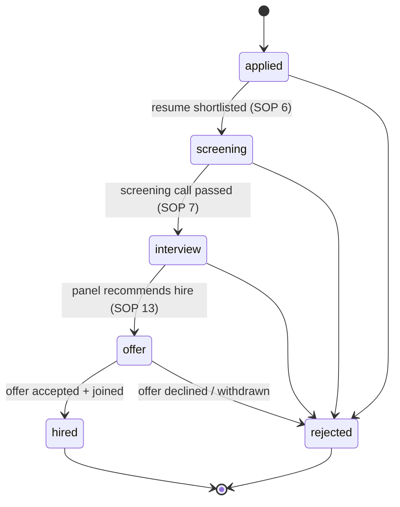

# 06 — Functional Spec: HR & Team Management (Module 4)

**Product:** Zogency — multi-tenant white-label agency CRM (tenant #1: BRB Digital, 8 people)
**Covers:** PRD Module 4 (FR-4.1–FR-4.13) · SOP-HR-01 (Recruitment, Selection & Onboarding, 25 steps)
**Phase:** All of this module ships in **Phase 2** (per doc 10 sprint plan; PRD §21 lists HR as "Phase 4" of its own release plan — the Zogency plan consolidates it into platform Phase 2. Labelled **P2** throughout.)
**Related docs:** [02-technical-architecture.md](02-technical-architecture.md) (RBAC, encryption, approval_requests), [03-data-model-erd.md](03-data-model-erd.md) §4.6/§5.6 (entities), [11-open-questions-and-risks.md](11-open-questions-and-risks.md) (Q14 payroll boundary, Q15 BGV gap, R8 DPDP)

---

## 1. Scope & overview

The PRD's Module 4 is a 13-FR compression of a richer documented process: SOP-HR-01's 25 steps (requisition → sourcing → interview → offer → pre-boarding → induction → confirmation), plus attendance/leave/performance/exit functions the SOP does not cover. This spec maps every SOP step to an FR and a section below, and states explicitly what is in and out.

**Explicit scope flags:**

- **SOP steps 17–19 (BGV, joining documents, IT/resource setup) have no PRD FR.** Per doc 11 **Q15** they are included as **onboarding-checklist item types** (§3.1) — BGV is a tracked checklist item with vendor name and report file attachment, not a vendor integration. Pending sign-off confirmation.
- **Payroll calculation is out of scope for Phases 1–2** per doc 11 **Q14**. The module's boundary is a per-pay-period attendance/leave **export** (§6); calculation stays in the external payroll tool.
- Job posting to external boards/LinkedIn (SOP step 4) is performed outside the system; the CRM records the requisition and receives candidates.

### 1.1 SOP-HR-01 → PRD FR mapping (25 steps)

| SOP step | Description | PRD FR | Spec § | In/Out |
|---|---|---|---|---|
| 1 | Identify vacancy, define JD/skills/reporting | FR-4.1 | §2.1 | In — captured on requisition form |
| 2 | Raise Manpower Requisition Form (MRF) | FR-4.1 | §2.1 | In — `job_requisitions` |
| 3 | Approve requisition | FR-4.1 | §2.1 | In — `approval_requests(type=requisition)` |
| 4 | Post the job (portals, LinkedIn, agencies) | — | §2.2 | **Out** — external activity; requisition holds a free-text `posting_channels` note only |
| 5 | Source candidates | FR-4.2 | §2.2 | In — candidate created against requisition (manual entry / CSV) |
| 6 | Screen resumes | FR-4.2 | §2.2 | In — Applied → Screening stage move + resume file |
| 7 | Initial HR screening call | FR-4.2 | §2.2 | In — screening fields: notice period, expected CTC, location, availability |
| 8 | Schedule interviews | FR-4.3 | §2.3 | In — `interviews` + CalendarPort |
| 9 | Technical/functional round | FR-4.3 | §2.3 | In — `interviews.round = technical` |
| 10 | HR/culture-fit round | FR-4.3 | §2.3 | In — `interviews.round = hr` |
| 11 | Assessment tests (if applicable) | FR-4.3 | §2.3 | In — `interviews.round = assessment`, work-sample file attached |
| 12 | Consolidate structured feedback | FR-4.3 | §2.3 | In — `interview_feedback` (append-only, per interviewer) |
| 13 | Shortlist final candidate | FR-4.4 | §2.4 | In — stage move Interview → Offer with consolidated feedback view |
| 14 | Compensation approval | FR-4.4 | §2.4 | In — `approval_requests(type=compensation)` |
| 15 | Extend verbal offer | FR-4.4 | §2.4 | In — offer status `draft` + logged comment; joining date captured |
| 16 | Issue offer letter | FR-4.4 | §2.4 | In — template-generated letter, status sent/accepted/declined |
| 17 | Initiate background verification | **none** | §3.1 | **In via Q15** — checklist item type `bgv` (vendor + report file); no BGV-vendor integration |
| 18 | Collect joining documents | **none** | §3.1 | **In via Q15** — checklist item type `document` per doc (ID, address, education, prior employment, bank) |
| 19 | Coordinate IT/resource setup | **none** | §3.1 | **In via Q15** — checklist item types `asset` / `access` assigned to IT/Admin |
| 20 | Day-1 formalities, employee ID, welcome kit | FR-4.5, FR-4.6 | §3.1–3.2 | In — hire conversion + Day-1 auto-link |
| 21 | Induction program | FR-4.5 | §3.1 | In — checklist item type `induction` with schedule |
| 22 | Role-specific orientation | FR-4.5, FR-4.6 | §3.1–3.2 | In — checklist item assigned to reporting manager |
| 23 | Buddy assignment | FR-4.5 | §3.1 | In — `buddy_user_id` on `employee_onboardings` |
| 24 | Probation review | FR-4.12/4.13 | §5.2 | **Partial** — modeled as a `performance_cycles` row of type `probation` per hire; uses the standard review workflow |
| 25 | Confirmation letter | — | §5.2 | **Partial** — confirmation date + letter file tracked on `employees` (`probation_ends_on`, confirmation letter as `files` attachment); no dedicated generation FR |

Functions in the PRD but **not** in SOP-HR-01 (the SOP ends at confirmation): exit/offboarding (FR-4.7, §3.3), attendance & leave (FR-4.8–4.10, §4), capacity & performance (FR-4.11–4.13, §5).

## 2. Recruitment & hiring (FR-4.1–4.4 · SOP steps 1–16)

### 2.1 Job requisitions (FR-4.1, SOP 1–3)

- A **Department Head** (permission `hr.raise_requisition`) raises a `job_requisitions` row: `department_id, role_title, headcount (int ≥1), budget_range, justification`, plus JD fields (skills, experience level, reporting manager) and free-text `posting_channels`.
- Submission creates `approval_requests(type=requisition, entity=job_requisitions)` routed to **Admin** (SOP names HR Manager + department head/Finance; at BRB's size the PRD collapses this to Admin — the generic approval workflow supports reassigning the approver).
- Requisition `status`: `open / on_hold / filled / cancelled`. Sourcing (candidate creation) is blocked until the approval request is `approved`. `filled` is set automatically when hired-candidate count reaches `headcount`.
- Open requisitions feed the FR-9.4 HR dashboard.

### 2.2 Candidate pipeline (FR-4.2, SOP 5–7)

`candidates` belong to exactly one approved requisition. Stage is a **DB enum** (doc 03 §6):

- Every stage move appends a `candidate_stage_history` row (`from, to, actor_id, at`) — **append-only [A]**, corrections via `supersedes_id` (doc 03 §3). No stage skipping except `→ rejected`, allowed from any non-terminal stage with a mandatory `rejection_reason`.
- Candidate record: `name, phone, email, resume_file_id` (upload via `files`), and **screening-call fields** captured at the Screening stage: `notice_period`, `expected_ctc`, current `location`, availability/earliest joining. Moving Screening → Interview requires notice_period and expected_ctc to be filled (workflow-gated entry per risk R3).
- Comments on candidates use the polymorphic `comments` table (timeline UX identical to leads).

### 2.3 Interviews & feedback (FR-4.3, SOP 8–12)

- `interviews`: `candidate_id, round(technical/hr/assessment), scheduled_at, panel_user_ids, calendar_event_ref`. Scheduling calls **CalendarPort** (`createEvent()`, Google Calendar adapter — doc 02 §6.2) to invite panel + candidate; `freeBusy()` assists slot picking. If the calendar integration is not connected, the interview is still saved and panelists get in-app/email notifications (fallback rule: no port blocks the workflow).
- For `assessment` rounds, the work sample / test file attaches via `files`.
- **`interview_feedback` [A]** — one row per interviewer per interview: `competency_scores jsonb` (named competencies with 1–5 scores, competency list configurable per requisition with seeded defaults), `recommendation (hire/no_hire)`, `notes`. Append-only; a correction is a new row superseding the old.
- **Blind feedback rule:** a panelist cannot read other panelists' feedback for the same interview until they have **submitted their own** (or the interview is marked feedback-complete by HR). Enforced in the query layer, not just UI.
- Consolidated view (SOP 12–13): per candidate, all rounds × all interviewers with scores and recommendations — visible to HR Manager and the Hiring Manager only (§7).

### 2.4 Offers (FR-4.4, SOP 13–16)

- One active `offers` row per candidate: `letter_file_id, compensation_encrypted, status(draft/sent/accepted/declined), joining_on, approval_request_id`.
- **Compensation approval before sending** (SOP 14): creating an offer with compensation raises `approval_requests(type=compensation)` to Admin/HR Manager per the approval matrix. Status cannot move `draft → sent` until approved.
- **Compensation is encrypted at rest** (AES-256-GCM app-level, doc 02 §8) and readable only with `hr.view_salaries` (§7). It never appears in list endpoints, logs, or notifications.
- **Offer letter generation:** rendered server-side (PDF pipeline, doc 02 §1) from a tenant-configurable template (role, compensation, joining date, terms — merge fields), stored in `files`, linked as `letter_file_id`. Verbal offer (SOP 15) is a logged comment + `joining_on` capture while status is still `draft`.
- Status transitions: `draft → sent → accepted | declined`; each transition is audit-logged with actor and timestamp. `accepted` requires an acceptance evidence attachment (signed letter upload or logged written acceptance). `declined` requires a reason and returns the candidate to `rejected` (reason `offer_declined`) unless HR re-opens negotiation with a superseding offer row.

## 3. Onboarding & offboarding (FR-4.5–4.7 · SOP steps 17–23)

### 3.1 Onboarding checklist (FR-4.5; SOP 17–23 incl. Q15 items)

On offer acceptance, an `employee_onboardings` record is created (pre-boarding starts before Day 1) with checklist items generated from a tenant-configurable template. **Item types** (each: `title, type, assignee_id, due_on, done_at, evidence_file_id, notes`):

| Type | Covers | Default assignee | SOP |
|---|---|---|---|
| `bgv` | Background verification — vendor name + report attachment | HR Manager | 17 (Q15) |
| `document` | One item per joining doc: ID proof, address proof, education certs, prior employment, bank details | HR Manager | 18 (Q15) |
| `asset` | Workstation, access card, welcome kit | IT/Admin | 19–20 (Q15) |
| `access` | Email ID, CRM login, tool accounts | IT/Admin | 19 (Q15) |
| `induction` | Induction session(s) with schedule date | HR Manager | 21 |
| `orientation` | Role expectations, goals, initial training plan | Reporting manager | 22 |
| `custom` | Anything tenant-specific | configurable | — |

- `employee_onboardings.buddy_user_id` records the buddy assignment (SOP 23).
- Document-type items store the uploaded doc via `files` — these are PII; access per §7.
- Onboarding is `complete` when all non-optional items have `done_at`; completion is reportable (time-to-productive metric).

### 3.2 Hire conversion & Day-1 auto-link (FR-4.6, SOP 20)

When candidate stage moves `offer → hired` (on/around `joining_on`), one transaction:

1. Creates a `users` row (email, initial role(s) per department mapping; status `active` on joining date, invite email with set-password link).
2. Creates the 1:1 `employees` row: `user_id, department_id, manager_id, designation, employment_type, joined_on, probation_ends_on` (default joined_on + tenant-configured probation months, 3–6).
3. **Day-1 auto-link:** the employee appears on their department's task board roster (assignable in `tasks`, counted in the §5.1 capacity view) and `manager_id` is set — leave requests (§4.3) and performance reviews (§5.2) route to this manager. A notification goes to the manager and the new hire.
4. Copies candidate PII linkage (`employees.candidate_id`) so the recruitment trail joins the employee record; requisition hired-count increments.

### 3.3 Exit workflow (FR-4.7 — not in SOP-HR-01)

`employee_exits` (1:0..1 per employee): `type(resignation/termination), notice_start_on, last_day_on, exit_interview_notes, asset_recovery jsonb, access_revoked_at`.

- **Notice tracking:** `notice_start_on` + tenant-configured notice period computes expected `last_day_on`; overridable with a logged reason. Employee `status` flips `active → notice` on exit creation.
- **Exit interview:** notes captured by HR; visible per §7.
- **Asset recovery checklist:** mirror of onboarding `asset`/`access` items (laptop, access card, account deactivations), each with `recovered_at` + recovered_by.
- **Access revocation:** on `last_day_on` (or immediately for termination), the linked `users.status` is set `disabled` — sessions revoked, login blocked. This action is **audit-logged** (actor, timestamp, before/after) and sets `access_revoked_at`. Employee `status → exited`, `exited_on` set. The employee row is soft-archived, never deleted (audit + payroll history).
- Exit completion requires: all asset-recovery items closed, access revoked, exit interview logged (termination may skip interview with Admin override, logged).

## 4. Attendance & leave (FR-4.8–4.10)

### 4.1 Attendance (FR-4.8)

- `attendance_records` **[A]**: `employee_id, date, in_at, out_at, mode(office/wfh/leave/holiday), source(manual/self)`; unique `(tenant_id, employee_id, date)`.
- **Self-marking:** each employee marks in/out from the app; WFH is a mode choice at mark-in. Marking is idempotent per day (out_at finalizes the existing row via the append pattern below).
- **Append-only with supersedes:** corrections (missed punch, wrong mode) insert a new row with `supersedes_id` pointing at the corrected row; readers resolve the latest non-superseded row per (employee, date). Manager/HR corrections carry `source=manual` and the actor is recorded — no UPDATE/DELETE ever (doc 03 §3, DB trigger backstop).
- `leave` and `holiday` mode rows are system-written from approved leave requests and the holiday calendar so every calendar day resolves to exactly one state — this is what the payroll export (§6) reads.

### 4.2 Holidays

`holidays`: `date, name` — tenant-configurable calendar, Admin/HR-managed, seeded yearly. Holidays suppress absence marking and are excluded from leave-day counts that span them (working-days counting; weekend definition in tenant settings).

### 4.3 Leave requests & balances (FR-4.9, FR-4.10)

- `leave_types` (tenant-configurable policy): `name, annual_quota, carry_forward` (max carry-forward days; 0 = lapse). Seeded: Casual, Sick, Earned, Unpaid (LOP).
- `leave_balances`: per `employee_id × type_id × year` — `available, used`. Initialized on Jan 1 / joining (pro-rated by joining month); carry-forward applied at year rollover by a worker job.
- `leave_requests`: `employee_id, type_id, from_on, to_on, reason, status(pending/approved/rejected/cancelled)`. Routed to the **reporting manager** (`employees.manager_id`) for approval; manager absent/self-request edge cases escalate to Admin. Approval/rejection requires a decision note; all transitions audit-logged.
- On approval: balance `used` increments by working days in range (holidays/weekends excluded); `attendance_records` mode `leave` rows are written for the range. Requests exceeding available balance are allowed only as Unpaid/LOP type (or blocked, per tenant setting).
- **Visibility (FR-4.10):** employee sees own balances and history; the reporting manager sees their reports' balances and a team leave calendar; HR Manager/Admin see all. Cancellation before start date reverses balance and attendance rows (via superseding rows, not deletes).

## 5. Task, workload & performance (FR-4.11–4.13)

### 5.1 Capacity view (FR-4.11 ↔ FR-6.7)

**One source of truth:** the capacity view is a **read model over the same `tasks` table the Delivery module writes** (doc 03 §5.5). HR/Module 4 introduces **no duplicate task or workload tracking** — FR-4.11 and FR-6.7 are the same query surfaced in two places.

Per department, per member: open task count by status, tasks due in next 7 days, overdue count, load indicator (open tasks vs department median; weighting configurable later — no estimation fields in P2). Approved leave (§4.3) overlays the view so managers see who is unavailable before assigning. Permission `hr.view_capacity` (Dept Heads see own department; Admin/HR all).

### 5.2 Performance cycles, goals, reviews (FR-4.12, FR-4.13; SOP 24–25)

- `performance_cycles`: `name, period_start, period_end, status(draft/active/review/closed)` — e.g. quarterly, created by HR Manager. A per-hire **probation cycle** (SOP 24) uses the same machinery: cycle scoped to one employee, period = joining → `probation_ends_on`.
- `employee_goals`: per employee per cycle — `title, kpi, target, weight` (weights per employee sum to 100; validated). Set by the manager with the employee at cycle start; editable until cycle enters `review` status, changes audit-logged.
- `performance_reviews` **[A]** — strictly ordered workflow per employee per cycle:
  1. **Self-assessment** — employee submits (locked after submit).
  2. **Manager review** — reporting manager reviews against goals; can read the self-assessment.
  3. **Final rating** — manager (Admin countersign optional per tenant setting) records rating on the tenant scale (seeded 1–5).
- Append-only: each step is a submitted, immutable record; corrections supersede. The manager review is hidden from the employee until final rating is released; release makes self + manager + rating visible to the employee.
- SOP 25 (confirmation): on a passed probation review, HR sets confirmation — `employees.probation_ends_on` reached + confirmation letter uploaded to `files` against the employee; employment_type/status unchanged (already `permanent/active`). Failed probation routes to exit workflow (§3.3) or extension (new probation cycle).
- Review history feeds FR-9.4 (headcount, attrition) and appraisal decisions — the module stores ratings; salary revision itself is outside (payroll boundary, §6).

## 6. Payroll export boundary (doc 11 Q14)

**Payroll calculation is explicitly out of scope for Phases 1–2.** The module's contract with the external payroll tool (tool name pending — Q14) is a **per-pay-period summary export**:

| Field | Source |
|---|---|
| employee (code, name) | `employees` |
| days present | `attendance_records` mode `office` + `wfh` (latest non-superseded per day) |
| WFH days | mode `wfh` subset |
| leave days by type | approved `leave_requests` → `leave` attendance rows, grouped by `leave_types` |
| LOP days | Unpaid-type leave + unmarked working days (per tenant policy flag) |

- **CSV** download per pay period (tenant-configured cycle, default calendar month), generated by a worker job and permission-gated (`hr.export_payroll`). Export is idempotent and re-runnable; each run is audit-logged.
- **API sync** if the chosen payroll tool exposes one — modeled as a future `PayrollPort` adapter (same port pattern as doc 02 §6.2); CSV is the guaranteed fallback and ships first.
- No salary amounts, compensation, or bank details flow through this export in P2 — attendance/leave counts only. A payroll-calculation engine is a Phase-3 candidate.

## 7. Privacy & access control

RBAC per doc 02 §4.2 — permission keys, multiple roles per user. HR-specific visibility matrix:

| Data | Employee (self) | Reporting manager | Dept Head | HR Manager | Admin | Others |
|---|---|---|---|---|---|---|
| Own attendance/leave, balances | RW (self-mark, apply) | R (reports only) | R (dept) | RW | RW | — |
| Leave approval | — | Approve (reports) | — | RW | RW | — |
| Candidate records, resumes, screening fields | — | Hiring Mgr: R (own requisition) | R (own dept requisitions) | RW | RW | Panelist: R (assigned candidates only) |
| Interview feedback | — | Hiring Mgr: R after own submission / feedback-complete | — | R (all) | R (all) | Panelist: own + others post-submission (§2.3 blind rule) |
| **Offer compensation** (`compensation_encrypted`) | Own offer letter only | — | — | `hr.view_salaries` | `hr.view_salaries` | Never |
| Onboarding docs (ID, bank, BGV report) | Own uploads | — | — | RW | R | IT/Admin: assigned asset/access items only (no documents) |
| Performance reviews & ratings | Own, post-release | RW (reports) | — | R (all) | R (all) | — |
| Exit records, exit-interview notes | Own exit status | R (reports; notes hidden) | — | RW | RW | — |
| Payroll export | — | — | — | `hr.export_payroll` | `hr.export_payroll` | — |

- **Encrypted fields** (app-level AES-256-GCM, key outside DB — doc 02 §8): `offers.compensation_encrypted`; bank-detail values on onboarding document items. Encrypted values excluded from list queries, search indexes, logs, and audit-log diffs (audit records "changed", not the value).
- **DPDP (doc 11 R8):** candidate and employee PII (resumes, ID/address/bank documents, BGV reports) is personal data under India's DPDP Act. India-region object storage; documented retention policy — rejected-candidate data purge after a tenant-configured period (default 12 months, hard-delete of resume/PII files with audit entry); employee records retained per statutory requirement post-exit; compliance erasure via the platform hard-delete path (doc 03 §1). DPDP policy document required before go-live (R8 owner: product owner + BRB).
- UI hiding is convenience only; every rule above is enforced at the server-action/query layer (doc 02 §4.2).

## 8. Acceptance criteria

**§2 Recruitment & hiring**
- AC-2.1: A requisition submitted by a Department Head creates a pending `approval_requests(type=requisition)`; candidates cannot be created against it until approved; approval by a non-Admin without the permission is rejected server-side.
- AC-2.2: Stage moves outside the diagram in §2.2 are rejected; every accepted move writes exactly one `candidate_stage_history` row; UPDATE/DELETE on that table fails at the DB trigger.
- AC-2.3: Rejection from any stage without `rejection_reason` fails validation; Screening → Interview without notice_period/expected_ctc fails validation.
- AC-2.4: Scheduling an interview with the calendar connected creates a Google Calendar event and stores `calendar_event_ref`; with it disconnected, the interview still saves and panelists are notified.
- AC-2.5: Panelist B requesting panelist A's feedback before B has submitted receives an empty/denied result; after B submits, A's feedback is readable.
- AC-2.6: An offer cannot move `draft → sent` while its compensation approval is pending/rejected; a user without `hr.view_salaries` fetching an offer receives the record with compensation absent (not masked client-side).

**§3 Onboarding & offboarding**
- AC-3.1: Offer acceptance generates the onboarding checklist including at least one `bgv`, the five `document` items, and `asset`/`access` items, each with the correct default assignee.
- AC-3.2: Marking a candidate `hired` creates linked `users` + `employees` rows in one transaction; the new employee is immediately assignable on their department's task board and their `manager_id` receives leave-request routing.
- AC-3.3: Completing an exit sets `users.status = disabled`, invalidates active sessions, writes `access_revoked_at`, and produces an `audit_logs` entry naming the actor; login attempts thereafter fail.
- AC-3.4: Exit cannot be completed with open asset-recovery items (except the logged Admin override for termination).

**§4 Attendance & leave**
- AC-4.1: Two mark-ins by the same employee on the same date resolve to one effective record; a correction produces a superseding row and the original remains readable in history.
- AC-4.2: An approved 3-working-day leave spanning a holiday deducts 3 (not 4) from `leave_balances.used` and writes exactly 3 `leave` attendance rows.
- AC-4.3: A leave request routes to the requester's `manager_id`; approval by any other non-Admin user is rejected. Employee sees own balances; a peer cannot query them.
- AC-4.4: Year rollover applies carry-forward up to the type's configured cap and lapses the remainder.

**§5 Capacity & performance**
- AC-5.1: Creating/closing a task in Delivery changes the HR capacity view on next read with no HR-side write — verified by asserting no HR-module table stores task state.
- AC-5.2: Goal weights per employee per cycle must sum to 100; submission otherwise fails.
- AC-5.3: Review steps enforce order (no manager review before self-assessment submit; no rating before manager review); each submitted step is immutable; the employee cannot read the manager review before release.

**§6 Payroll export**
- AC-6.1: The CSV for a pay period contains one row per active employee with the five field groups of §6; totals reconcile with attendance/leave data for the period; re-running the export yields identical output and each run appears in `audit_logs`.
- AC-6.2: No compensation or bank-detail field appears in the export.

**§7 Privacy**
- AC-7.1: `offers.compensation_encrypted` at rest is ciphertext (verified by direct DB read); audit-log diffs for offers never contain the plaintext value.
- AC-7.2: Every visibility rule in the §7 matrix has a server-side test; UI-only enforcement counts as a failure.

## 9. Traceability matrix

| FR | SOP-HR-01 steps | Spec § | Entities | Phase |
|---|---|---|---|---|
| FR-4.1 | 1–3 | §2.1 | job_requisitions, departments, approval_requests, users | P2 |
| FR-4.2 | 5–7 (4 out of scope) | §2.2 | candidates, candidate_stage_history, files, comments | P2 |
| FR-4.3 | 8–12 | §2.3 | interviews, interview_feedback, files | P2 |
| FR-4.4 | 13–16 | §2.4 | offers, approval_requests, files | P2 |
| FR-4.5 | 17–19 (via Q15), 20–23 | §3.1 | employee_onboardings, files, users | P2 |
| FR-4.6 | 20, 22 | §3.2 | candidates → users + employees, departments, tasks | P2 |
| FR-4.7 | — (not in SOP) | §3.3 | employee_exits, employees, users, audit trail via audit_logs | P2 |
| FR-4.8 | — | §4.1 | attendance_records, holidays | P2 |
| FR-4.9 | — | §4.3 | leave_requests, leave_types, employees (manager routing) | P2 |
| FR-4.10 | — | §4.3 | leave_balances, leave_types | P2 |
| FR-4.11 | — | §5.1 | tasks (read-only — shared with FR-6.7), departments, employees, leave_requests | P2 |
| FR-4.12 | 24 (probation cycle) | §5.2 | performance_cycles, employee_goals | P2 |
| FR-4.13 | 24–25 | §5.2 | performance_reviews, employees, files (confirmation letter) | P2 |
| *(no FR — Q15)* | 17, 18, 19 | §3.1 | employee_onboardings item types bgv/document/asset/access | P2 (pending Q15 confirmation) |
| *(no FR — Q14)* | — | §6 | attendance_records, leave_requests, leave_types, employees | P2 (export only; calculation Phase 3 candidate) |
