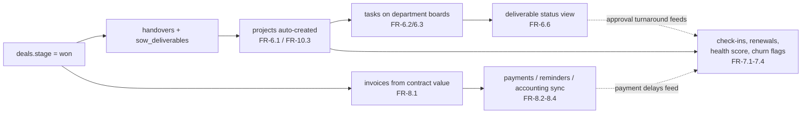
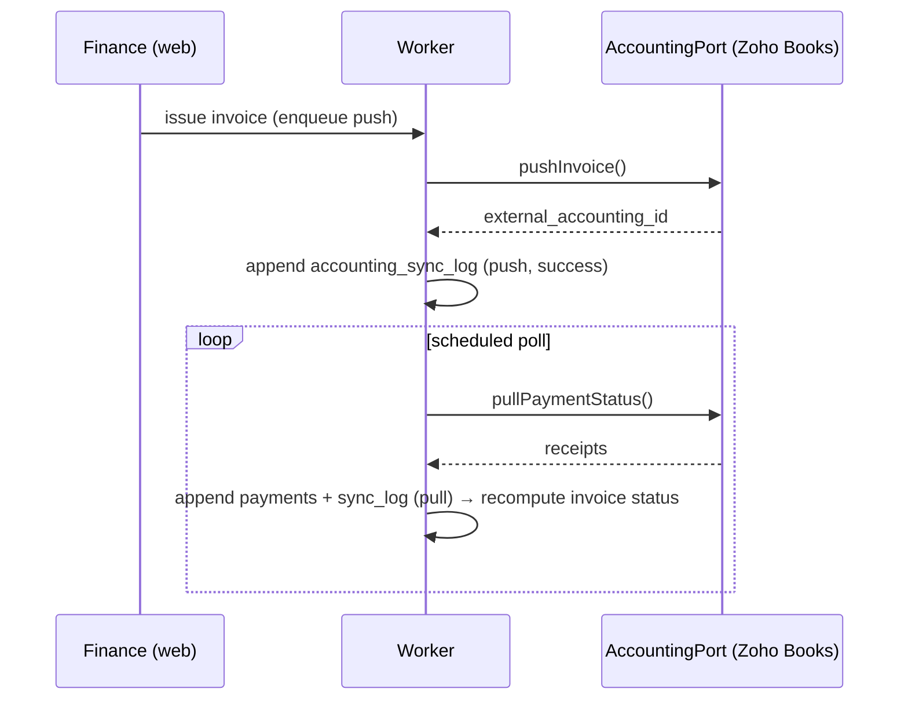

# 07 — Functional Spec: Delivery & Work Management, Retention & Renewal, Invoicing & Payments

**Product:** Zogency — multi-tenant, white-label agency CRM SaaS (tenant #1: BRB Digital)
**Covers:** PRD Module 6 (FR-6.1–6.7), Module 7 (FR-7.1–7.6), Module 8 (FR-8.1–8.4); operationalizes SOP-SLS-01 §5.7 (Steps 19–21)
**Related docs:** [02-technical-architecture.md](02-technical-architecture.md) (worker, adapter ports, files), [03-data-model-erd.md](03-data-model-erd.md) (entity contract), [11-open-questions-and-risks.md](11-open-questions-and-risks.md) (Q3, Q9, Q12, O4)
**Status:** Draft for developer review

---

## 1. Scope & overview

This spec covers the three post-sale module chains. They pick up exactly where the sales spec (doc 05/06) hands off: a deal marked **Won** with a completed handover and mandatory `sow_deliverables` line items (risk R5: a deal cannot be Won without them).

| Module | What it delivers | Primary actors |
|---|---|---|
| 6 — Delivery & Work Management | Per-client delivery projects, department Kanban boards, tasks with dependencies/files/recurrence, deliverable tracking against SoW | Delivery team, Department heads (TLs), Account owner |
| 7 — Retention & Renewal | Check-ins, renewal outreach automation, client health score, churn flags, upsell tracker, weekly pipeline review (SOP Steps 19–21) | Account owner, Sales Manager |
| 8 — Invoicing & Payments | Invoices from contract/milestones, payment tracking, overdue reminders, one-way accounting sync | Finance, Account owner |

Modules 7 and 8 are coupled by design: payment behavior (Module 8) is the largest input to the client health score (Module 7 §5.3).

## 2. Delivery projects (FR-6.1)

### 2.1 Auto-creation on Won

When `deals.stage` transitions to `won`, the seeded automation rule `won → create_delivery_project` (doc 08 §2, FR-10.3) enqueues a worker job that, in one transaction:

1. Creates the `clients` record if not already present (FR-5.1, Module 5 spec).
2. Creates one `projects` row: `client_id`, `handover_id` (FK to the deal's handover), `name` defaulted to `"{client.name} — {service summary}"` (editable), `status = active`, `start_on = won date`.
3. Sets `projects.type`:
   - `retainer` — any linked `sow_deliverable.frequency` is recurring (`monthly`, `weekly`, …). `end_on` = contract renewal date (mirrors the `renewals` row, §5.2).
   - `one_off` — all deliverables are `one_time`. `end_on` = latest deliverable deadline.
4. Notifies the relevant department head(s) — the departments referenced by the SoW's `service_catalog` mapping — with the SoW attached (FR-5.5).

Project creation is idempotent per deal (unique partial index on `projects(tenant_id, handover_id)`); replaying the automation is a no-op.

### 2.2 Project detail page

Composition (top to bottom):

| Section | Source |
|---|---|
| Header: client, type badge (retainer/one_off), status, start/end, account owner | `projects`, `clients` |
| Deliverable status board (§4.4) | `sow_deliverables` + linked `tasks` |
| Task list (filterable by department/assignee/status) | `tasks` |
| Files (version chains, §4.2) | `files` where `entity_type = 'task'` for the project's tasks, plus project-level attachments |
| Handover context: account context, commitments, key contacts | `handovers`, `client_contacts` |
| Activity: task status changes + comments, newest first | `task_status_history`, `comments` |
| Linked invoices summary (number, total, status) | `invoices` where `project_id` matches |

Project `status` is manually managed (`active/paused/completed`); marking `completed` warns if any linked task is not `done` and any `sow_deliverable.status ≠ delivered`.

## 3. Department task boards (FR-6.2, FR-6.7)

### 3.1 Boards

One Kanban board per `departments` row. Departments are a **tenant-configurable table**, seeded for BRB as: SEO, Design, Social, Video, Content, Web, Performance (doc 11 Q12 — seed list pending confirmation; changes are settings, not code). Adding/renaming/archiving a department is an Admin settings action; archiving requires zero open tasks or a reassignment target.

- Columns = the five task statuses (fixed DB enum): `todo → in_progress → review → done`, plus `blocked` rendered as a flagged lane/overlay, not a sequential column.
- Cards show: title, client/project, assignee avatar, deadline (red when past), priority chip, dependency lock icon when blocked-by-dependency (§4.1), recurring icon when template-generated.
- Filters: assignee, client/project, priority, overdue-only. Board scope is always one department; a cross-department "My tasks" view exists per user.
- Drag between columns = status change → appends `task_status_history` (append-only [A], the source for FR-9.3 turnaround metrics). Transitions into `done` run the dependency gate (§4.1).

### 3.2 Single source of truth with HR capacity (FR-6.7 ↔ FR-4.11)

There is **one `tasks` table**. The HR capacity view (Module 4.4, doc 06) is a read model (`delivery-tasks/queries.ts` shared query) over the same rows: open task count and overdue count per `assignee_id`, grouped by `departments`. No mirrored or synced "workload" table exists — any divergence between the Delivery board and the HR capacity view is a bug by definition.

## 4. Tasks (FR-6.3–6.6)

### 4.1 Assignment, deadline, priority, dependencies (FR-6.3)

`tasks` fields per doc 03 §5.5: exactly one of `project_id`/`campaign_id` required; `department_id`, `assignee_id`, optional `sow_deliverable_id`, `deadline`, `priority (low/medium/high/urgent)`, `status`.

**Dependencies** — `task_dependencies (task_id, depends_on_task_id)`:

- Cycles rejected at write time (DFS check within the project's task graph).
- **Done-gate:** a task cannot move to `done` while any `depends_on_task_id` task is not `done`. The UI warns with the list of incomplete blockers. A user holding the `tasks.override_dependency` permission (seeded to Manager/Admin roles) may proceed; the override is recorded in `task_status_history` metadata + `audit_logs`.
- A task whose dependencies are incomplete shows the lock icon; moving it to `in_progress` is allowed (work can start early) — only `done` is gated.
- Overdue tasks feed FR-10.4 SLA escalation (worker sweep on `(tenant_id, deadline, status)` index, doc 03 §7).

### 4.2 Files with version control (FR-6.4)

Uploads attach to tasks via the shared `files` infrastructure (doc 02 §7): signed-URL upload to object storage, metadata row with `entity_type='task', entity_id`. **Version chains use `files.version_of`** — a re-upload against an existing file creates a new `files` row pointing at its predecessor. The task shows the latest version with an expandable history (uploader, timestamp, size). This is the same mechanism as creative assets (FR-3.9) — one implementation, two consumers.

### 4.3 Recurring tasks for retainers (FR-6.5)

`recurring_task_templates`: `project_id, title_template, department_id, cadence (cron expression), next_run_on, active`. Default assignee and priority are carried on the template.

- A nightly worker job selects templates where `next_run_on <= today AND active`, generates one `tasks` instance per template (`recurring_template_id` set, `status = todo`, deadline derived from cadence period end), advances `next_run_on` from the cron expression, and notifies the assignee.
- Generation is idempotent per (template, period) — unique index on `tasks(tenant_id, recurring_template_id, period_key)`.
- Templates are auto-suggested at project creation from recurring `sow_deliverables` (e.g. "Monthly content calendar — 12 posts" → monthly template on the Content board); the Delivery lead confirms/edits before activation.
- Templates deactivate automatically when `projects.status` leaves `active`.

### 4.4 Deliverable status view (FR-6.6)

On the project page, every `sow_deliverable` renders one row:

| Column | Source |
|---|---|
| What | `sow_deliverables.description` (+ `service_catalog.name`) |
| Quantity / frequency | `quantity`, `frequency` |
| Deadline | `deadline` (or "recurring — {frequency}") |
| Current status | **Derived from linked tasks** (below) + task progress count (e.g. "3/5 done") |

Derivation (computed in the read model, then persisted to `sow_deliverables.status` on task-status change for cheap reads):

| Linked tasks state | Deliverable status |
|---|---|
| No tasks linked yet | `not_started` |
| ≥1 task beyond `todo`, not all `done` | `in_progress` |
| Any linked task `blocked` | `at_risk` |
| All linked tasks `done` (one-time) | `delivered` |
| Recurring: current period's generated tasks all `done` | `on_track` (rolls each period) |

Tasks link via `tasks.sow_deliverable_id`, settable at creation or later. Deliverables with no linked tasks after 7 days from project start trigger a nudge notification to the department head.

## 5. Retention & renewal (FR-7.1–7.6)

Operationalizes SOP-SLS-01 §5.7 — Steps 19 (check-ins), 20 (renewal tracking), 21 (pipeline & forecast review).

### 5.1 Relationship check-ins (FR-7.1 · SOP Step 19)

`client_checkins` [A]: `client_id, scheduled_at, held_at, notes, owner_id`.

- The account owner schedules check-ins per client (ad-hoc or a repeating cadence, e.g. monthly for retainers — tenant default in `tenant_settings`). Scheduling creates a Google Calendar event via `CalendarPort` when connected.
- Logging a held check-in appends the row with notes; notes render on the client record's timeline. Rows are append-only — corrections supersede, never edit.
- A worker sweep flags check-ins `scheduled_at` past with no `held_at` → notification to the owner; clients with no check-in held in N days (tenant-configurable, default 45) surface on the retention dashboard.
- The check-in form includes an optional "upsell signal" prompt that pre-fills an `upsell_opportunities` draft (§5.5) — Step 19's "identify upsell/cross-sell opportunities" made concrete.

### 5.2 Renewal tracking & outreach (FR-7.2 · SOP Step 20)

`renewals`: `client_id, contract_ref, renewal_on, value, status (upcoming/in_progress/renewed/lost)`. A row is auto-created for retainer projects at project creation (`renewal_on` = contract end); one-off clients get none unless added manually.

**Worker triggers** (daily sweep on the `(tenant_id, renewal_on, status)` index) fire at **60, 30, and 15 days** before `renewal_on` for `status IN (upcoming, in_progress)`:

| Trigger | Actions |
|---|---|
| T−60 | Notification (in-app + email) to account owner; auto-create task "Renewal outreach — {client}" on owner's queue, deadline T−45; renewal → `in_progress` |
| T−30 | Notification to account owner **and Sales Manager**; auto-create follow-up task if the T−60 task is not done |
| T−15 | Escalation notification to Sales Manager; client flagged "renewal at risk" on the retention dashboard |

Each trigger fires at most once per renewal row (fired-marker per stage in the row's JSON metadata — replays are no-ops). Marking `renewed` records the new `value` and creates the successor `renewals` row; marking `lost` prompts a churn reason and raises a `churn_flags` row (§5.4). Both feed FR-9.5 renewal/churn-rate reporting.

### 5.3 Client health score (FR-7.3) — proposed default formula, pending sign-off (doc 11 Q9)

> **Sign-off required.** The PRD names the inputs but no formula. The following is the proposed tenant default; **weights and bands are tenant-configurable** (`tenant_settings.health_score_config` JSON). Approve or amend via doc 11 Q9.

**Score = 100 − (weighted penalty sum), clamped to 0–100.** Three components:

| Component | Weight | Metric (rolling window) | Penalty bands (0 = best, 100 = worst) |
|---|---|---|---|
| **Payments** | **40%** | Avg days overdue across invoices due in the last 90 days (`invoices.due_on` vs `payments.received_on`; unpaid overdue invoices count as overdue-to-date) | 0 days → 0 · 1–7 → 25 · 8–15 → 50 · 16–30 → 75 · >30 → 100 |
| **Approval turnaround** | **30%** | Avg days from work shared for client review to client sign-off, last 90 days (`client_signoffs` / task `review→done` timestamps for delivery approvals) | ≤2 days → 0 · 3–5 → 25 · 6–10 → 50 · 11–15 → 75 · >15 → 100 |
| **Satisfaction** | **30%** | Latest `survey_responses` (NPS or CSAT) | NPS 9–10 → 0 · 7–8 → 25 · 5–6 → 50 · 3–4 → 75 · 0–2 → 100 (CSAT mapped 5→0 … 1→100) |

Missing data rule: a component with no data in the window contributes penalty 0 (benefit of the doubt) and is marked `insufficient_data` in the components JSON so the UI shows a hollow segment, not false confidence.

**Bands:** **Green ≥ 70 · Amber 40–69 · Red < 40.**

Worked example: client pays on average 10 days late (50), signs off in 4 days (25), latest NPS 8 (25) → `100 − (0.4·50 + 0.3·25 + 0.3·25) = 100 − 35 = 65` → **Amber**.

**Computation:** weekly worker job (Monday 06:00 tenant-local) computes the score per active client and **appends** to `client_health_scores` [A]: `client_id, score, components jsonb (per-component metric, band, penalty, weight), computed_at`. History is never rewritten — the client page shows the current band chip plus a trend sparkline over past rows.

### 5.4 Churn-risk flags & escalation (FR-7.4)

Immediately after each weekly scoring run, the worker raises a `churn_flags` [A] row when either:

- the latest score is **Red**, or
- the latest **2+ consecutive** scores are **Amber** (no Green between).

Row: `client_id, reason` (generated from the worst component, e.g. "Health Red — payments avg 34 days overdue"), `severity (amber_trend/red)`, `escalated_to`, `resolved_at`. Raising a flag notifies the **account owner and Sales Manager** (in-app + email) and creates a "Churn-risk review — {client}" task on the account owner's queue. Open flags dedupe: no new flag while an unresolved one exists for the client; resolution (`resolved_at` + note) is manual and audited. `renewals.status = lost` also raises a flag with `severity = churned` for post-mortem tracking.

### 5.5 Upsell / cross-sell tracker (FR-7.5)

`upsell_opportunities`: `client_id, service_id (FK service_catalog), stage (idea/proposed/won/lost), value, owner_id`. Created manually, from the check-in prompt (§5.1), or suggested from `service_catalog` entries the client doesn't yet buy. Moving to `proposed` can spawn a `deals` record so the opportunity travels the standard proposal/pipeline flow; `won` upsells append their deliverables to the client's handover SoW and project. Aggregate open upsell value appears on the retention dashboard and the weekly review view.

### 5.6 Weekly pipeline & forecast review (FR-7.6 · SOP Step 21)

A dedicated Sales Manager view (also the substrate for FR-9.1's pipeline report):

- **Open deals by stage** (`deals.stage IN (open, verbal_commit)`): count and value per stage, per owner.
- **Expected close:** deals grouped by `expected_close_on` month; overdue-expected-close flagged.
- **Forecast value:** Σ(`deals.value` × stage weight — tenant-configurable, seeded open 50% / verbal_commit 90%).
- **Hygiene panel:** deals with no activity in 14 days, deals missing `expected_close_on` or `value` — "maintain accurate CRM records" (Step 21) made enforceable.
- Retention strip: upcoming renewals (next 90 days), open churn flags, open upsell value.

The view reads live for BRB-scale data; a Monday-morning `report_snapshots` precompute + optional email digest to the Sales Manager satisfies the 3-second dashboard NFR as data grows.

## 6. Invoicing & payments (FR-8.1–8.4)

### 6.1 Invoice generation (FR-8.1)

Invoices are generated from the **contract value/milestones** after Finance validates pricing (SOP Step 16, FR-2.19):

- **Sources:** one-off projects → milestone-split invoices proposed from the deal's `final_terms` (e.g. 50% advance / 50% on delivery — editable); retainers → a monthly invoice proposed from contract value (auto-drafted by the worker on the tenant's billing day; Finance reviews and issues — no auto-send in Phase 1).
- `invoices`: `client_id, project_id, number, issue_on, due_on, subtotal, gst_rate, gst_amount, total, status, external_accounting_id`. `invoice_line_items` link to `sow_deliverables` (`description, sow_deliverable_id, qty, rate, amount`) so every line traces to a contracted deliverable.
- **Numbering:** tenant-scoped sequence, format configurable in `tenant_settings` (seed: `{prefix}-{FY}-{seq}`, e.g. `BRB-2026-27-0042`); numbers are allocated at issue (not draft) and never reused. GST fields per Indian invoicing basics; full e-invoicing/HSN detail is out until Phase 3 (doc 11 O5).
- White-label PDF via the shared PDF service (doc 02 §1), branded from `tenant_settings`.
- Issuing an invoice requires the `invoicing.issue` permission (Finance/Admin roles).

### 6.2 Payment status tracking (FR-8.2)

Status enum: `pending / partial / paid / overdue`.

- `payments` [A]: `invoice_id, amount, received_on, method, reference` — append-only; a mis-entered payment is superseded, never edited.
- On each payment append, invoice status recomputes in-transaction: Σ payments = 0 → `pending`; 0 < Σ < total → `partial`; Σ ≥ total → `paid`.
- **Overdue is materialized by a nightly worker job** (doc 03 §6): invoices with `due_on < today AND status IN (pending, partial)` → `overdue` (index `(tenant_id, due_on, status)`). Payment receipt on an overdue invoice recomputes to `partial`/`paid` immediately. UI shows days-overdue alongside the badge.
- Payment data feeds the health score (§5.3) — no separate bookkeeping.

### 6.3 Automated payment reminders (FR-8.3)

Seeded automation rule `invoice_overdue → payment_reminder_sequence` (`automation_rules`, Admin-editable):

| Reminder | Offset from due date | Channel (defaults) | Tone/template |
|---|---|---|---|
| 1 | +3 days | Email to primary `client_contacts` | Gentle nudge |
| 2 | +7 days | Email + WhatsApp (via `MessagingPort`) | Firm, statement attached |
| 3 | +14 days, then every +14 | Email + WhatsApp; internal escalation to account owner + Finance | Final notice; human follow-up task created |

- Every send appends `payment_reminders` [A] (`invoice_id, sent_at, channel, template_key`) and a `notifications` row; each `automation_runs` row records the execution.
- **Stop conditions:** invoice reaches `paid`, or Finance sets a per-invoice `reminders_paused` flag (disputes/agreed terms) — checked at send time, so an overnight payment cancels the morning reminder.
- Cadence offsets, channels, and templates (`message_templates`) are tenant-configurable; WhatsApp templates require Meta approval (risk R12 — email fallback always available).

### 6.4 Accounting sync via AccountingPort (FR-8.4)

The PRD's mandate: **sync with the existing accounting tool, don't duplicate it.** The accounting tool remains the **books of record**; Zogency is the operational layer.

- **Direction:** one-way **push** of issued invoices (`AccountingPort.pushInvoice()` → stores `external_accounting_id`) + **status pull** (`pullPaymentStatus()`, scheduled worker poll) that appends `payments` rows for receipts recorded in the accounting tool. Zogency never edits accounting-side records beyond its own pushed invoices; manual payments entered in Zogency are advisory until reconciled.
- **`accounting_sync_log`** [A]: `direction (push/pull), entity_type, entity_id, external_id, status (success/failed), error, at` — one row per operation, success or failure. Failed pushes retry with backoff; persistent failures surface on a Finance sync-health panel. Invoices with no successful push show an "unsynced" badge.
- **Adapter: Zoho Books first** (doc 11 **Q3** — recommended: clean REST API, days of work). **If BRB commits to Tally**, there is no native cloud API (Tally Prime gateway/ODBC or middleware required): sync moves wholly to **Phase 2** as its own mini-project, and Phase 1 ships invoicing standalone with CSV export for manual books entry. The port interface is identical either way — only the adapter and timeline change.
- **Razorpay payment links** (doc 11 **O4**, ruling pending): if ruled in and Zoho Books is chosen, issued invoices carry a Razorpay payment link (trivial via Zoho Books integration) in Phase 1 S6; webhook-confirmed payments append `payments` rows automatically. If ruled out or Tally chosen, invoices carry static bank/UPI details from `tenant_settings`. **No card/checkout flow is built in-app either way.**

## 7. Acceptance criteria

**Delivery projects (§2)**
- AC-D1: Marking a deal Won (with complete SoW) produces exactly one `projects` row linked to the handover, with correct `type` (retainer when any deliverable frequency is recurring); replaying the automation creates no duplicate.
- AC-D2: Project page shows every `sow_deliverable` with what/quantity/frequency/deadline/derived status, and linked invoices.

**Boards & tasks (§3–4)**
- AC-D3: Renaming/adding a department in tenant settings changes the board list with no code change; archiving is blocked while open tasks exist.
- AC-D4: Dragging a card writes `task_status_history`; the history row is not updatable or deletable (DB trigger backstop).
- AC-D5: Moving a task to `done` while a dependency is incomplete is blocked with a warning naming the blockers; a Manager-role user can override, and the override appears in `audit_logs`.
- AC-D6: Adding a dependency that would create a cycle is rejected.
- AC-D7: Re-uploading a file to a task creates a new `files` row with `version_of` set; the prior version remains downloadable.
- AC-D8: An active monthly `recurring_task_template` generates exactly one task per month per template, even if the worker job runs twice.
- AC-D9: The HR capacity view and the department board show identical open/overdue task counts for the same user at the same instant (same query, one table).

**Retention (§5)**
- AC-R1: A renewal 60/30/15 days out fires exactly one notification set + auto-task per threshold; a renewal marked `renewed` fires no further triggers and spawns the successor row.
- AC-R2: Weekly scoring appends one `client_health_scores` row per active client with a components JSON containing metric, penalty, weight, and band per component; prior rows are never modified.
- AC-R3: Given avg 10 days payment overdue, 4-day approval turnaround, NPS 8, the computed score is 65 (Amber) under default weights; changing tenant weights changes the next computed score without touching history.
- AC-R4: A Red score, or a second consecutive Amber, raises exactly one open `churn_flags` row (no duplicates while unresolved) and notifies account owner + Sales Manager.
- AC-R5: The weekly review view shows open deals by stage with owner, expected-close grouping, weighted forecast value, and the no-activity-14-days hygiene list.

**Invoicing (§6)**
- AC-F1: Invoice numbers are unique per tenant, sequential, allocated only at issue; two tenants can hold the same number.
- AC-F2: Payments are append-only; recording partial then full payment moves status `pending → partial → paid`; the nightly job marks unpaid past-due invoices `overdue`.
- AC-F3: Overdue reminders fire at +3/+7/+14 days per the seeded rule, append `payment_reminders`, and stop immediately once the invoice is `paid` or paused — including a send scheduled after an overnight payment.
- AC-F4: Every `pushInvoice`/`pullPaymentStatus` call appends an `accounting_sync_log` row (including failures); a failed push retries and the invoice shows "unsynced" until success.
- AC-F5: With Razorpay ruled in (O4): a webhook-confirmed link payment appends a `payments` row and recomputes status without manual entry.

## 8. Traceability matrix

Phase labels: **P1-S6** = Phase 1 Sprint 6 (basic delivery + basic invoicing land with go-live); **P2** = Phase 2 (per doc 10 sprint plan).

| FR | Spec § | Entities | Phase |
|---|---|---|---|
| FR-6.1 Delivery project auto-created per client, linked to SoW | §2.1–2.2 | projects, handovers, sow_deliverables, clients, automation_rules | P1-S6 |
| FR-6.2 Department-wise task boards | §3.1 | departments, tasks, task_status_history | P1-S6 |
| FR-6.3 Task assignment: deadlines, priority, dependencies | §4.1 | tasks, task_dependencies, task_status_history, audit_logs | P1-S6 (basic: assign/deadline/priority) · P2 (dependencies + override) |
| FR-6.4 File/asset upload with version control per task | §4.2 | files (version_of), tasks | P2 |
| FR-6.5 Recurring task automation for retainers | §4.3 | recurring_task_templates, tasks, projects | P2 |
| FR-6.6 Deliverable status view | §4.4 | sow_deliverables, tasks, service_catalog | P2 |
| FR-6.7 Boards share HR capacity data | §3.2 | tasks, departments (shared read model with FR-4.11) | P2 (with HR module) |
| FR-7.1 Scheduled relationship check-ins | §5.1 | client_checkins, clients, notifications | P2 |
| FR-7.2 Renewal tracking + 60/30/15 outreach | §5.2 | renewals, notifications, tasks, automation_rules | P2 |
| FR-7.3 Client health score | §5.3 | client_health_scores, invoices, payments, client_signoffs, surveys/survey_responses, tenant_settings | P2 (formula pending Q9 sign-off) |
| FR-7.4 Churn-risk flag + escalation | §5.4 | churn_flags, notifications, tasks | P2 |
| FR-7.5 Upsell/cross-sell tracker tied to service catalogue | §5.5 | upsell_opportunities, service_catalog, deals | P2 |
| FR-7.6 Weekly pipeline/forecast review | §5.6 | deals, renewals, churn_flags, upsell_opportunities, report_snapshots | P2 |
| FR-8.1 Invoices from contract value/milestones | §6.1 | invoices, invoice_line_items, sow_deliverables, projects, deals | P1-S6 |
| FR-8.2 Payment status pending/partial/paid/overdue | §6.2 | invoices, payments | P1-S6 |
| FR-8.3 Automated payment reminders on overdue | §6.3 | payment_reminders, automation_rules, automation_runs, message_templates, notifications | P1-S6 |
| FR-8.4 Accounting sync (Zoho Books / Tally) | §6.4 | accounting_sync_log, invoices, payments, integration_credentials | P1-S6 if Zoho Books (Q3) · P2 if Tally; Razorpay links per O4 ruling |

**Open items blocking full implementation:** Q3 (accounting tool — decides FR-8.4 phase), Q9 (health-score formula sign-off), Q12 (confirm department seed list), O4 (Razorpay ruling).
