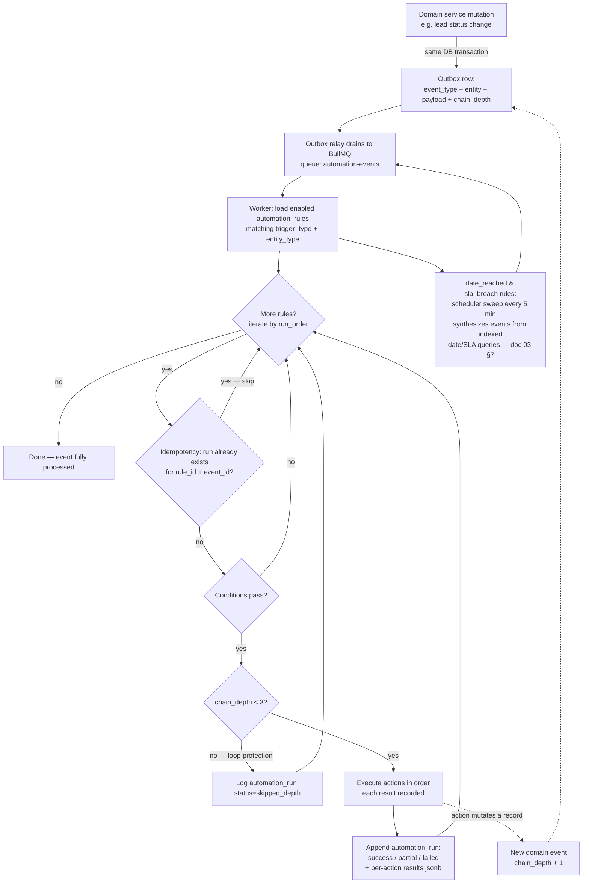

# 08 — Functional Spec: Automation Engine, Notifications & Reporting/Analytics

**Product:** Zogency — multi-tenant, white-label agency CRM SaaS (tenant #1: BRB Digital)
**Covers:** PRD Module 9 (FR-9.1–9.6), Automation Engine (FR-10.1–10.4), PRD §22 success-metrics instrumentation
**Related docs:** [02-technical-architecture.md](02-technical-architecture.md) (worker/BullMQ, adapter ports, NFR mapping), [03-data-model-erd.md](03-data-model-erd.md) (§5.8 entities), [11-open-questions-and-risks.md](11-open-questions-and-risks.md) (Q16, R12)

---

## 1. Scope & overview

Automation, notifications, and reporting are **cross-cutting services** consumed by every module chain. The chain specs (docs 04–07: sales, marketing, HR, delivery/retention/finance) **reference this document** for any "auto-notify", "escalate", "reminder", or "dashboard" behavior — they do not re-specify it. Anything a chain spec needs is expressed here as either:

1. a **seeded automation rule** (§3) it can point to by rule key, or
2. a **dashboard metric definition** (§5) it can point to by metric key.

Three subsystems, all running in the `worker` process (doc 02 §2) unless noted:

| Subsystem | What it does | Core entities |
|---|---|---|
| Automation engine | Evaluates trigger→condition→action rules on domain events and schedules | `automation_rules`, `automation_runs`, `sla_escalations` |
| Notification framework | Renders and delivers messages across in_app/email/whatsapp/sms | `notifications`, `message_templates` |
| Reporting & analytics | Precomputes dashboard snapshots; serves 6 dashboards + drill-downs | `report_snapshots`, `kpi_snapshots`, `campaign_reports` |

## 2. Automation rule model (FR-10.1)

### 2.1 Rule shape

Rules live in `automation_rules` — **tenant-scoped, Admin-editable without code changes** (Configurability NFR). Engine ships in P1 with seeded rules (§3); the Admin rule-builder UI ships in P2 (until then, rules are edited via a platform-admin JSON editor with schema validation).

| Field | Type | Semantics |
|---|---|---|
| `name` | text | Human label, unique per tenant |
| `trigger_type` | enum | `record_created` \| `status_changed` \| `date_reached` \| `sla_breach` |
| `entity_type` | text | Target entity: `lead`, `deal`, `task`, `invoice`, `campaign`, `approval_request`, `renewal`, … |
| `conditions` | jsonb | Conjunction (AND) of predicates: `[{ "field": "...", "op": "...", "value": ... }]` |
| `actions` | jsonb | Ordered array of action objects (§2.3) |
| `enabled` | boolean | Disabled rules are skipped, never deleted (history integrity) |
| `run_order` | int | Evaluation order among rules matching the same event (lower first) |

### 2.2 Conditions

Each predicate: `{ "field": string, "op": operator, "value": any }`. All predicates must pass (conjunction). Empty array = always matches.

- **Operators:** `eq`, `neq`, `gt`, `gte`, `lt`, `lte`, `in`, `not_in`, `is_null`, `is_not_null`, `contains`.
- **Field paths** resolve against the trigger entity's current row, plus event metadata: `status_changed` events expose `$from_status` and `$to_status`; `date_reached` exposes `$days_until` / `$days_since`.
- Unknown field or type-mismatched comparison → the rule run is recorded as `failed` with a validation error; the event continues to the next rule (a bad rule never blocks the chain).

### 2.3 Actions

Ordered array; each item is `{ "type": ..., ...params }`:

| `type` | Params | Behavior |
|---|---|---|
| `assign` | `strategy` (or explicit `user_id`) | Runs `assignment_rules` engine (doc 04); appends `lead_assignments` row |
| `notify` | `channel`, `template_key`, `recipient_role` (or `recipient_field`, e.g. `owner_id`, or the lead/client contact itself) | Resolves recipients → notification framework (§4). `recipient_role` fans out to every user holding the role |
| `create_record` | `record_type` (`task` \| `project` \| `reminder`), `fields` (templated) | Creates the record via the owning module's domain service (so its own events/audit fire) |
| `schedule_event` | `calendar`, `offset`, `attendees`, `title_template` | CalendarPort event (e.g. meeting reminders, kickoff call) |
| `escalate` | `to_role`, `template_key` | Appends `sla_escalations` row + notifies the target role (in_app + email minimum) |

### 2.4 Evaluation pipeline

Domain services publish **domain events in-transaction** via a transactional **outbox** table row committed atomically with the business write; an outbox relay drains it into BullMQ. This guarantees no event is lost if the process dies between commit and enqueue, and no event fires for a rolled-back transaction.

**Trigger sourcing:**
- `record_created` / `status_changed` — emitted by domain services (create + status-transition paths).
- `date_reached` / `sla_breach` — a **scheduler sweep** (repeatable BullMQ job, every 5 min) queries the SLA/date indexes (doc 03 §7: `leads.sla_due_at`, `invoices.due_on`, `renewals.renewal_on`, `tasks.deadline`, `approval_requests.requested_at`) and synthesizes one event per newly-matching row. The sweep is idempotent: an event id is derived deterministically (e.g. `sla_breach:lead:{id}:{sla_due_at}`), so re-sweeps dedupe via §2.5.

### 2.5 Idempotency

`automation_runs` has a unique index `(tenant_id, rule_id, trigger_event_id)`. Exactly **one run per rule per event**; BullMQ retries and duplicate sweep emissions hit the index and no-op. `trigger_event_id` is the outbox row id (or the deterministic id for scheduled triggers).

### 2.6 Execution logging & failure handling

- Every evaluation that passes conditions appends an `automation_runs` row (**append-only**, doc 03 §3): `rule_id, trigger_entity_type/id, actions_executed jsonb` (per-action: type, params snapshot, `ok`/`error`, duration ms), `status(success/partial/failed), error, at`.
- **Partial success:** actions run in order; a failed action is recorded and the remaining actions still execute (actions are independent side effects). Status = `partial` if ≥1 succeeded and ≥1 failed.
- **Retry:** transient failures (port timeouts, provider 5xx) retry with exponential backoff (BullMQ: 3 attempts, 30s/2m/10m). Only the failed actions re-execute — completed action results are persisted on the run row and skipped on retry. After final failure, status = `failed`/`partial` and a Sentry alert fires; Admin sees failures in the automation-runs log view.
- Notification-action failures additionally trigger channel fallback (§4.3) before counting as failed.

### 2.7 Loop protection

Every domain event carries `chain_depth` (0 for user/webhook-originated mutations). Mutations performed *by an automation action* stamp their resulting events with `chain_depth + 1`. Rules are **not evaluated when `chain_depth ≥ 3`** — the run is logged with status `skipped_depth` so loops are visible, not silent. This bounds any rule-triggers-rule cascade at 3 hops regardless of rule configuration.

## 3. Seeded rules (FR-10.1–10.4)

Seeded per tenant by the seed script (doc 03 §8, migration 3). Admin may edit/disable but the keys are stable — chain specs reference rules by `key`.

| Key | FR | Trigger | Condition | Actions |
|---|---|---|---|---|
| `lead_welcome` | FR-10.1 | `record_created` on `lead` | — | `assign` (assignment_rules strategy); `notify` whatsapp `tpl_lead_welcome` → lead contact; `notify` in_app+whatsapp `tpl_lead_assigned` → `recipient_field: owner_id` (FR-1.6) |
| `followup_email` | FR-10.2 | `status_changed` on `lead` | `$to_status eq Follow-up` | `notify` email `tpl_followup` → lead contact (from owner's sender identity) |
| `meeting_reminders` | FR-10.2 | `status_changed` on `lead` | `$to_status eq Meeting Scheduled` | `schedule_event` CalendarPort (meeting + T-1h reminder) attendees: owner + lead; `notify` whatsapp `tpl_meeting_confirm` → lead contact |
| `won_handover` | FR-10.3 | `status_changed` on `deal` | `$to_status eq won` | `create_record` project (from handover/SoW — FR-6.1); `notify` in_app+email `tpl_won_handover` → `recipient_role: department_head` for each department named in SoW deliverables (FR-5.5) |
| `invoice_overdue_reminders` | FR-10.3 | `date_reached` on `invoice` | `status in [pending, partial]`, `$days_since(due_on) in [1, 7, 14]` | `notify` email `tpl_payment_reminder` → client billing contact (logged to `payment_reminders` — FR-8.3); at day 14 also `notify` in_app → `recipient_field: owner_id` |
| `brief_signed_off` | FR-10.3 | `status_changed` on `approval_request` | `type eq brief`, `$to_status eq approved` | `notify` in_app+email `tpl_brief_approved` → `recipient_role: strategy` |
| `sla_lead_uncontacted` | FR-10.4 | `sla_breach` on `lead` | `first_contacted_at is_null`, `sla_due_at` passed (default 24h — `tenant_settings`) | `escalate` to_role `sales_manager` `tpl_sla_lead` (appends `sla_escalations` — FR-2.5) |
| `sla_task_overdue` | FR-10.4 | `sla_breach` on `task` | `status not_in [done]`, `deadline` passed | `escalate` to department `head_user_id` `tpl_sla_task` |
| `sla_approval_stale` | FR-10.4 | `sla_breach` on `approval_request` | `state eq pending`, `$days_since(requested_at) gte 2` | `notify` in_app+whatsapp `tpl_approval_nudge` → `recipient_field: approver_id` (repeats every 48h while pending) |
| `renewal_outreach` | FR-7.2 (companion) | `date_reached` on `renewal` | `status in [upcoming, in_progress]`, `$days_until(renewal_on) in [60, 30, 15]` | `notify` in_app+email → `recipient_field: owner_id`; `create_record` task "renewal outreach" — referenced by doc 07 |

## 4. Notification framework

### 4.1 Channels & templates

- **Channels:** `in_app`, `email`, `whatsapp`, `sms` — delivered via `MessagingPort`/`EmailPort` adapters (doc 02 §6.2); in_app is first-party (DB + SSE/poll).
- **`message_templates`** — tenant-scoped, Admin-editable (Configurability NFR): `channel, key, name, body, variables jsonb, whatsapp_approval_status`. Body uses `{{variable}}` placeholders; `variables` declares the expected keys (render fails fast on missing vars → run marked failed, not sent half-rendered). One `key` may exist per channel — the notify action picks the row matching its channel.
- **WhatsApp:** templates carry Meta approval status (`draft/submitted/approved/rejected`). Submit all seeded templates in Phase 0/Sprint 1 (doc 11 Q4, R12).

### 4.2 Delivery log

Every send appends a `notifications` row (**append-only**): `user_id` (null for external recipients — lead/client contact stored in `payload`), `channel, template_key, payload jsonb (rendered vars + destination), status(queued/sent/delivered/failed), read_at, delivered_at, error`. Provider delivery callbacks (WhatsApp webhooks, SES events) update status via superseding rows per the append-only pattern.

### 4.3 Fallback (R12)

If a WhatsApp send targets an **unapproved template**, or the WhatsApp provider send **fails after retries**, the framework automatically re-issues the notification on the fallback chain **email → in_app** using the same `key` (each template key is seeded on all three channels). The fallback send is a new `notifications` row referencing the failed one; the automation action counts as succeeded if any channel delivers.

### 4.4 Preferences & notification center

- **Per-user preferences** (settings JSON on user): mute non-critical notifications per channel. Notifications are flagged `critical` (SLA escalations, assignments, approvals directed at you) or `informational`; critical ignores mutes. External recipients (leads/clients) have no preference layer in Phase 1 — future consent handling tracked with DPDP work (doc 11 R8).
- **In-app notification center:** bell + unread count; list newest-first; mark read (sets `read_at` via superseding row) / mark-all-read; click-through deep-links to the source entity.

## 5. Dashboards (FR-9.1–9.6)

All metrics below are the **canonical definitions** — chain specs and the snapshot jobs (§6) implement exactly these. Dashboards read `report_snapshots`; drill-downs run live scoped queries.

### 5.1 FR-9.1 — Sales dashboard

| Metric | Formula | Source & filters |
|---|---|---|
| Lead-to-win conversion | count(`deals` where `stage = won` and `won_at` in period) ÷ count(`leads` where `created_at` in period) | Grouped by `lead_sources.type`, `leads.city`, `leads.industry` (city/industry are captured on the lead specifically for this — doc 03 §5.2). Denominator excludes `archived_at` set |
| Calls made / connected (BDE-wise) | count(`calls`) / count(`calls` where `disposition = connected`) per `calls.user_id` in period | Includes `is_manual_log` rows |
| Revenue won (BDE-wise) | sum(`deals.value`) where `stage = won`, `won_at` in period, per `deals.owner_id` | Tenant currency |
| Avg first-response time (BDE-wise) | avg(`min(first touch) − leads.created_at`); first touch = earliest of first `calls.started_at` or first `lead_status_history.at` leaving New, per lead | Leads created in period with ≥1 touch; also report p95 and %-within-SLA (feeds §8) |
| Pipeline & forecast | open `deals` (`stage in [open, verbal_commit]`) grouped by `stage` × `expected_close_on` month; sum(`value`) and count per cell | Weekly review view (FR-7.6) reads the same snapshot |

### 5.2 FR-9.2 — Marketing dashboard

| Metric | Formula | Source & filters |
|---|---|---|
| KPI performance per campaign | latest `kpi_snapshots.value` per `campaign_kpis` vs `campaign_kpis.target`; % attainment = value ÷ target | Active campaigns (`status in [launched, monitoring]`); sparkline from snapshot time series |
| Optimization log feed | latest N `optimization_logs` (change_type, description, reasoning, actor, at) | Per campaign and cross-campaign feed |
| Report archive | `campaign_reports` list (campaign, `presented_at`, report file link) | All closed campaigns; links to white-label PDF (§7) |

### 5.3 FR-9.3 — Delivery dashboard

| Metric | Formula | Source & filters |
|---|---|---|
| On-time delivery rate | count(tasks done on time) ÷ count(tasks done), per `tasks.department_id`; done-at = first `task_status_history.at` where `to = done`; on time ⇔ done-at ≤ `tasks.deadline` | Tasks reaching done in period; tasks without a deadline excluded |
| Task turnaround | avg(done-at − `tasks.created_at`) per department | Same population; also median (deadline outliers skew the mean) |

### 5.4 FR-9.4 — HR dashboard

| Metric | Formula | Source & filters |
|---|---|---|
| Headcount by department | count(`employees` where `status in [active, notice]`) per `department_id` | As-of snapshot date |
| Attrition (12m rolling) | count(`employee_exits` in trailing 12m) ÷ avg monthly headcount over the same 12m | Avg headcount from monthly `kpi`-style snapshot points (§6) |
| Open requisitions | count(`job_requisitions` where `status = open`), per department | With age (days since created) |
| Leave utilization | sum(`leave_balances.used`) ÷ sum(annual quota) per employee, aggregated per department | Current leave year |

### 5.5 FR-9.5 — Retention dashboard

| Metric | Formula | Source & filters |
|---|---|---|
| Renewal rate | count(`renewals` where `status = renewed`) ÷ count(`renewals` where `status in [renewed, lost]`) | Renewals decided in period (`upcoming/in_progress` excluded from denominator) |
| Churn rate | count(`clients` transitioned to `churned` in period) ÷ count(`clients` active at period start) | Transition date from `audit_logs`/status history |
| Avg client lifetime value | avg over churned clients of sum(`invoices.total` where `status in [paid, partial]`, paid portion via `payments`) per client | Churned clients only (completed lifetimes); shown alongside active-client running total |

### 5.6 FR-9.6 — Executive dashboard

One page, five tiles — **every tile reads `report_snapshots` only** (no live queries) so it always meets the <3s NFR:

| Tile | Reads |
|---|---|
| Pipeline value | §5.1 pipeline snapshot (total open value + stage split) |
| Campaign health | §5.2 — campaigns count by status + % KPIs on target |
| Delivery on-time % | §5.3 — tenant-wide rate + worst department |
| Headcount | §5.4 — total + open requisitions |
| Retention health | §5.5 — renewal rate, churn rate, count of red `client_health_scores` / open `churn_flags` |

## 6. Snapshot & performance strategy

- Scheduled BullMQ repeatable jobs in the worker compute each dashboard's metrics and append `report_snapshots` rows: `dashboard_key, period, scope jsonb (grouping dims), computed jsonb (metric values), computed_at`.
- Dashboards read the **latest snapshot per key** — one indexed read, satisfying the <3s NFR by construction. `computed_at` renders as "data as of …".
- **Drill-downs** (click a cell → underlying leads/tasks/invoices) query live, bounded by the doc 03 §7 indexes; acceptable because drill-down scopes are small.
- A manual "refresh now" (Admin) enqueues the compute job on demand.

| `dashboard_key` | Period granularity | Schedule | Snapshot scope dims |
|---|---|---|---|
| `sales` | day + month-to-date | **hourly** | source_type, city, industry, owner_id, stage×close-month |
| `marketing` | day | nightly (00:30 IST) | campaign_id |
| `delivery` | week + month | nightly | department_id |
| `hr` | month | nightly (1st-of-month row is the headcount point for attrition) | department_id |
| `retention` | month + quarter | nightly | — |
| `executive` | day | hourly (composes latest of the above) | — |

## 7. Report generation & archive

- **White-label PDF:** campaign performance reports (FR-3.18/3.19) and, later, exec summaries render server-side (doc 02 §1 PDF stack) using tenant branding from `tenant_settings` (logo, primary color, sender name) — **no Zogency branding anywhere** on tenant output.
- Generated PDFs are stored via the `files` table (polymorphic attach to the campaign/report) and linked from `campaign_reports.report_file_id`; the report archive view (§5.2) lists them.
- **Scheduled email delivery** of reports (e.g. monthly exec summary to Admin, campaign report to client contact) is **Phase 2** — implemented as a `date_reached` automation rule + `notify` email with PDF attachment.

## 8. Success-metrics instrumentation (PRD §22)

Every §22 metric is measured **from day 1** so improvement claims have data behind them. Baselines: per doc 11 **Q16**, BRB's pre-CRM current-state numbers are captured in the Phase-0 workshops and stored as tenant-level reference values displayed next to each live metric.

| Success metric (PRD §22) | Where measured | Baseline capture plan (Q16) |
|---|---|---|
| Lead response time (target: 90%+ within SLA) | §5.1 avg/p95 first-response + %-within-SLA; raw events: `leads.created_at` → first `calls`/`lead_status_history` | Phase-0 workshop: sample recent sheet/inbox leads, estimate current response lag |
| Lead-to-win conversion increase | §5.1 conversion by source/city/industry (monthly series) | Current conversion from BRB's existing records (imported via CSV, doc 11 R10) |
| % marketing projects launched on agreed date | `campaign_channels.go_live_at` (actual) vs `campaign_plans` planned launch milestone; on-time ⇔ actual ≤ planned | Workshop estimate from recent campaigns |
| % delivery completed on time, per department | §5.3 on-time delivery rate | Workshop estimate per department |
| Renewal rate / churn rate | §5.5 | Current book of clients + last-12-months renewals from BRB records |
| Sales-to-Delivery handoff time (target: same-day) | `deals.won_at` → `handovers.completed_at` (computed in `sales` snapshot) | Workshop estimate of current handoff lag |
| Time-to-hire | `job_requisitions.created_at` → `offers` accepted-at (`candidate_stage_history` to `hired` as fallback) | Recent hires' dates from HR records |

## 9. Acceptance criteria

**Automation engine (§2):**
- A committed domain mutation always yields exactly one evaluation pass per matching enabled rule; killing the worker mid-flight never loses or duplicates a run (outbox + idempotency index proven by an integration test).
- Rules evaluate in `run_order`; disabled rules never run; a rule with an invalid condition logs `failed` and does not block subsequent rules.
- A run with one failing action out of three records `partial` with per-action results; retry re-executes only the failed action.
- A rule chain that would recurse (action → event → same rules) stops at depth 3 with `skipped_depth` runs logged.
- Admin can view `automation_runs` filtered by rule/status/entity.

**Seeded rules (§3):** each rule in the §3 table has an automated test that fires its trigger and asserts the exact side effects (assignment row, notification rows on the right channels/templates/recipients, created records, `sla_escalations` rows). Overdue-invoice and renewal cadences fire once per threshold day, never twice (sweep idempotency).

**Notifications (§4):** sending with an unapproved WhatsApp template delivers via email→in_app fallback and logs both attempts; missing template variables fail the render before any provider call; muting a channel suppresses informational but not critical notifications; unread count and read-state round-trip in the notification center.

**Dashboards (§5):** each metric matches a hand-computed fixture dataset to the definition in its table (unit tests on the snapshot compute functions); grouping dims (source/city/industry/department) each produce correct splits; executive dashboard renders entirely from snapshots with zero live aggregate queries (asserted via query logging in test).

**Snapshots (§6):** every dashboard page p95 load < 3s with seeded 2-year data volume; snapshot staleness never exceeds its schedule interval + 10 min (alert otherwise); "refresh now" produces a new snapshot row.

**Reports (§7):** generated PDF carries tenant logo/colors and no platform branding; file stored and linked from `campaign_reports`.

**Instrumentation (§8):** all seven §22 metrics resolvable from day-1 data structures with no schema change; baseline reference values displayable beside each.

## 10. Traceability matrix

| FR | Spec section | Entities | Phase |
|---|---|---|---|
| FR-10.1 rule engine + new-lead rule | §2, §3 `lead_welcome` | automation_rules, automation_runs, lead_assignments, message_templates, notifications | **P1** engine + seeded rules; **P2** Admin rule-builder UI |
| FR-10.2 status-based email/reminders | §3 `followup_email`, `meeting_reminders` | automation_rules, notifications, message_templates (CalendarPort) | P1 |
| FR-10.3 event-based automation | §3 `won_handover`, `invoice_overdue_reminders`, `brief_signed_off` | automation_rules, projects (create), notifications, payment_reminders, approval_requests | P1 (won/invoice); P2 (brief — marketing module) |
| FR-10.4 SLA escalations | §2.4 sweep, §3 `sla_*` rules | automation_rules, sla_escalations, notifications | P1 |
| FR-9.1 Sales dashboard | §5.1, §6 | leads, lead_sources, deals, calls, lead_status_history, report_snapshots | **P1-S6** (basic); full in P2 |
| FR-9.2 Marketing dashboard | §5.2 | campaign_kpis, kpi_snapshots, optimization_logs, campaign_reports, report_snapshots | P2 |
| FR-9.3 Delivery dashboard | §5.3 | tasks, task_status_history, departments, report_snapshots | P2 |
| FR-9.4 HR dashboard | §5.4 | employees, departments, job_requisitions, leave_requests/balances, report_snapshots | P2 |
| FR-9.5 Retention dashboard | §5.5 | renewals, clients, invoices, payments, client_health_scores, report_snapshots | P2 |
| FR-9.6 Executive dashboard | §5.6 | report_snapshots (composite) | P2 |
| §22 instrumentation | §8 | webhook_events, calls, deals, handovers, campaign_channels, job_requisitions, offers | P1 onward (measured from day 1) |
